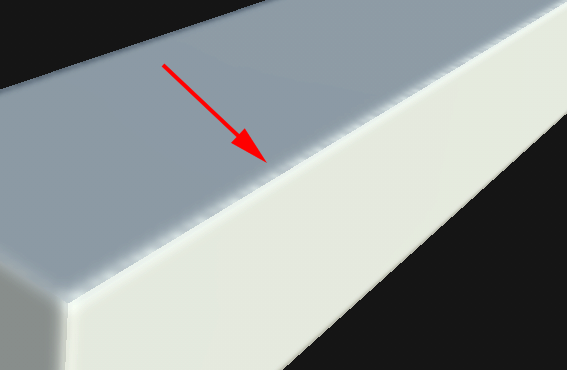
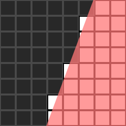

# UV 接縫上的鋸齒現象

>[!WARNING]
>
> **子嗣**
> 
> 烘烤後，UV 接縫邊界會出現暗點或暗點：
> 
> 

>[!NOTE]
>
> **說明**
> 
> 當烘焙師將資訊寫入貼圖時，必須將幾何轉換成像素。 處理這些資訊時可能會產生 [混疊現象](https://en.wikipedia.org/wiki/Aliasing)。 鋸齒現象常因 UV 的幾何形狀未與像素格線對齊，或是 UV 覆蓋的像素數不足以提供足夠解析度而發生。
> 
> 以下圖片中的幾何圖形是紅色覆蓋層。 若像素表面超過一半被幾何體覆蓋，烘焙者會標記該像素為滿（白色方格為完整像素，黑色方格為空像素）。 右側影像的像素格點解析度是兩倍，能更精確地呈現幾何體。
> 
> 
> 
> 

>[!NOTE]
>
> **解法**
> 
> * 提高 Baker 的輸出材質解析度。
> * 提高抗鋸齒設定（注意：計算可能會花更多時間）。
> * 在 3D 建模軟體的 UV 編輯器中，將 UV 對齊到像素格子。
> * 給UV更好的像素比。
