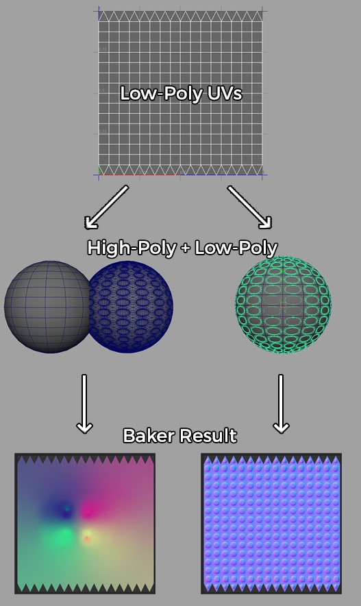

# 法線貼圖有奇怪的彩色漸層

烘焙機的輸出是一組非常強烈且色彩繽紛的漸層。

## 說明

色彩漸層通常是在烘焙過程中高多邊形與低多邊形網格不匹配時產生。 這種不匹配可以用以下原因解釋：

* 高多邊形和低多邊形的網格 <b>彼此沒有正確重疊</b> （見下方圖片）。
* 高多邊形缺少 <b>低多邊形試圖覆蓋的幾何</b> 體。
* 高多邊形或低多邊形網格的頂點法線是反轉的。

當這種情況發生時，烘焙過程會嘗試匹配不存在的幾何形狀，結果是空的。 烘焙者會用從貼圖中鄰近像素提取的顏色填滿這個空白區域，產生彩色漸層（除非 <b>關閉擴散</b> 功能）。

## 解法

鑑於導致網格不重疊的可能原因有限，必須考慮以下幾種解法：

* 記得凍結或重置網格轉換（重設 x-form 等），確保所有網格都一致
* 在你的 3D 建模軟體中匯入低多邊形和高多邊形網格，以確認它們是否正確重疊
* 如果你使用 [「按名稱](../../features/matching-by-name/matching-by-name.md) 匹配」功能，請確認命名規則是否有效（你可以透過烘焙驗證，然後查看日誌檔，該檔案會印出網格名稱）。

### 範例

下面是一個高多邊形和低多邊形球體的範例。 左邊的網格沒有重疊，因為高多邊形已經移開了：

