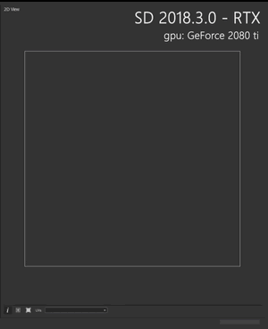

# GPU 光線追蹤

<table>
<tr style="border: 0;">
<td style="border: 0;" valign="top">

有些烘焙師支援 GPU 上的光線追蹤硬體加速，通常能將運算速度提升 25 倍以上。

## 硬體需求

若系統符合以下要求，光線追蹤將自動啟用：

* 已安裝相容的顯示卡/*（RTX 系列、Titan V 或 GeForce 10xx）
* GPU 驅動程式是最新的
* 已安裝 Windows 10「秋季創建者」/十月更新（版本 1809）或更高版本\*\*

</td>
<td style="border: 0;" valign="top">

{zoomable="yes"}

</td>
</tr>
</table>

\*：相容的 NVIDIA GPU 包含所有使用 Pascal 架構或較近期的 GPU。 例如，GTX 10 系列、Titan V 系列、RTX 20 系列，或是較新的型號。

\*\*：要查看你的 Windows 版本，請點選開始選單，輸入「winver」並按 Enter。\
你可以透過 [Microsoft 支援網站的專屬頁面](https://support.microsoft.com/en-us/help/4028685/windows-10-get-the-update) 獲得更新。

>[!TIP]
>
> 如果遇到問題，可以在應用程式偏好設定中關閉 GPU 光線追蹤。

## 支持烘焙師

以下表格列出了每位烘焙師依據 Substance 3D 烘焙版本對 GPU 光線追蹤的支援：

+++版本 3 及以上

| 貝克 | 支援 GPU 光線追蹤 |
| --- | --- |
| 環境遮蔽 | 

 |
| 彎曲正常 | 

 |
| 顏色 | 

 |
| 曲率 | 

 |
| 高度 | 

 |
| 正常 | 

 |
| 正常世界空間 | 

 |

| 貝克 | 支援 GPU 光線追蹤 |
| --- | --- |
| 不透明度遮罩 | 

 |
| 位置 | 

 |
| 位置低 | 

 |
| 厚度 | 

 |
| 轉印紋理 | 

 |
| 世界與切線 | 

 |

+++

+++版本 2

| 貝克 | 支援 GPU 光線追蹤 |
| --- | --- |
| 環境遮蔽 | 

 |
| 網格環境遮蔽 | 

 \* |
| 網格彎曲法線 | 

 \* |
| 網格色彩 | 

 \* |
| 將 UV 轉換成 SVG | 

 |
| 網格曲率 | 

 \* |
| 網格高度 | 

 \* |
| 從網格中取法線 | 

 \* |

| 貝克 | 支援 GPU 光線追蹤 |
| --- | --- |
| 網格的不透明度遮罩 | 

 \* |
| 網格位置 | 

 \* |
| 位置 | 

 |
| 網格厚度 | 

 \* |
| 從網格轉移貼圖 | 

 \* |
| 世界空間方向 | 

 |
| 世界空間法線 | 

 |

\*：支援 CPU 光線追蹤，速度明顯比 GPU 光線追蹤慢很多。

+++
