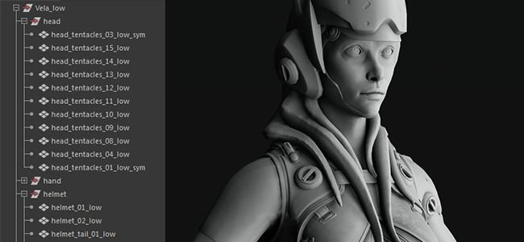

# 姓名配對

Matching By Name 是一種過濾方法，可用於 Substance Bakers 根據名稱分離低多邊形與高多邊形網格。

此功能對於避免烘焙過程中幾何體相互滲出非常實用，能達成乾淨的紋理。 它避免了必須移動網格（通常稱為「爆炸」）來達成相同效果。

## 何時使用姓名配對

### 法線貼圖烘焙搭配網格出血

在這個例子中，角色頭頂的頭盔會流血到角色臉上。

啟用「按名字匹配」後，我們就能忽略頭盔，正確烘焙臉部。 *這個結果是基於主要的配對設定。*

| *網狀* | *按姓名配對* | *按姓名配對 On* |
| --- | --- | --- |
| {width="250px"} | {width="250px"} | {width="250px"} |

### 忽略浮動幾何體的背面

在這個例子中，盒子頂端的「按鈕」是浮動幾何體，它們並未連接到高多邊形網格。 因此，它們會預設在下方的框框上投射陰影，該框會顯示幾何邊界。

透過啟用「Matching By Name」的 **「忽略背面」** 設定，我們可以烘焙環境遮蔽，同時忽略按鈕下方的區域，讓它看起來像是一個整體的方框。*此結果是基於忽略背面設定的使用。*

| *網狀* | *按姓名配對* | *按姓名配對 On* |
| --- | --- | --- |
| {width="250px"} | {width="250px"} | {width="250px"} |

## 姓名配對的運作方式

「依名稱匹配」系統透過讀取低多邊形與高多邊形網格中的幾何名稱，並使用關鍵字（後綴）來識別/匹配名稱來運作。 預設情況下，烘焙師會使用特定的後綴，但可以更改（見下文）。

目前支援的後綴有：

| *後綴類型* | *預設值* | *使用情況* |
| --- | --- | --- |
| 高多邊形 | *\_high* | 用來分離高多邊形網格的名稱，讓它與低多邊形網格相匹配。 |
| 低多邊形 | *\_low* | 用來分離低多邊形網格的名稱，以匹配高多邊形網格。 |
| 忽略背面 | *\_ignorebf* | 用來忽略使用次要光線的烘焙者背面，例如環境遮蔽。*這個後綴應該只出現在高多邊形網格上，例如：**mesh\_high\_ignorebf*** |

以下是一些讓此功能正常運作的規則：

* 必須在 [Common Parameters（Common Parameters](../../bakers-settings/common-parameters/common-parameters.md)）中啟用「以名字匹配」，因為預設&#x200B;**是**&#x200B;關閉的。
* 某些烘焙機（如 [環境遮蔽](../../bakers-settings/ambient-occlusion-from/ambient-occlusion-from-mesh.md)）可能會啟用次級「按名稱匹配」設定，因為它們會產生次級光線。
* 匹配是區分大小寫的，這表示名為「**Vela**」的網格不會與另一個名為「**vela**」的網格匹配。
* 多個網格可以根據幾何體名稱中後綴的位置來匹配。

以下是配對可能的運作範例（使用預設後綴）：

| 低多邊形名稱 | 會和高多邊形匹配 | 無法與高多音音色匹配 |
| --- | --- | --- |
| <ul data-preserve-html="true"><li data-preserve-html="true">body_low</li></ul> | <ul data-preserve-html="true"><li data-preserve-html="true">body_high</li><li data-preserve-html="true">body_high_top</li><li data-preserve-html="true">body_high_1</li><li data-preserve-html="true">body_high_2</li></ul> | <ul data-preserve-html="true"><li data-preserve-html="true">身高</li><li data-preserve-html="true">body_top_high</li></ul> |
| <ul data-preserve-html="true"><li data-preserve-html="true">Head_low</li></ul> | <ul data-preserve-html="true"><li data-preserve-html="true">Head_high</li></ul> | <ul data-preserve-html="true"><li data-preserve-html="true">head_high</li></ul> |
| <ul data-preserve-html="true"><li data-preserve-html="true">Leg_low_top</li></ul> | <ul data-preserve-html="true"><li data-preserve-html="true">Leg_high</li><li data-preserve-html="true">Leg_high_top</li><li data-preserve-html="true">Leg_high_high_top</li></ul> | <ul data-preserve-html="true"><li data-preserve-html="true">Leg_top_high</li></ul> |

## 如何設置烘焙師

### 啟用姓名配對

可在 Baker 設定的 Common Parameters（共用參數[&#128279;](../../bakers-settings/common-parameters/common-parameters.md)）中啟用 Matching By Name：

| *軟體* | *設定設定* |
| --- | --- |
| **物質畫家** | <ol class="steps" data-preserve-html="true"> <li class="step" data-preserve-html="true">     透過貼圖集設定開啟烘焙視窗。    </li> <li class="step" data-preserve-html="true">     顯示常見參數。    </li> <li class="step" data-preserve-html="true">     將設定 <strong>匹配</strong> 從「Always」改成「依網格名稱」。      </li> </ol> |
| **物質設計師** | <ol class="steps" data-preserve-html="true"> <li class="step" data-preserve-html="true">     在檔案總管視窗中右鍵點擊連結網格，開啟烘焙視窗。    </li> <li class="step" data-preserve-html="true">     將設定  <strong>匹配</strong>  從「Always」改成「依網格名稱」。        </li> </ol> |

### 更改後綴名稱

預設後綴為 \_low 和 \_high，且可透過以下方式更改：

* **Substance Painter**：在烘焙視窗[&#128279;](../../getting-started/software-interface/3d-painter/substance-3d-painter.md)中，在常見參數範圍內。
* **Substance Designer**：在 [專案設定](https://experienceleague.adobe.com/en/docs/substance-3d-designer/using/workspace/preferences/project-settings)中，烘焙設定下。

## zBrush 的高多邊形網格

從 zBrush 匯出的高多邊形網格可用於「按名稱匹配」功能烘焙，但可能需要遵守以下設定：

| *檔案格式* | *描述* |
| --- | --- |
| **FBX** | 沒有特定的啟用或停用參數，網格檔案可以直接使用。 |
| **OBJ** | zBrush 匯出的 OBJ 檔案預設無法支援 **Matching By Name** 。 相反地，可以讓 Substance Painter 用網格的檔名來依名稱來匹配網格。為此，務必：<ol data-preserve-html="true"><li data-preserve-html="true"><strong>關閉</strong>每個</strong>子工具的<strong>群組（Grp）參數。</li><li data-preserve-html="true"><strong>請適當命名</strong> OBJ 檔案（例如： <strong>body_high.obj</strong>）。</li></ol>  |
