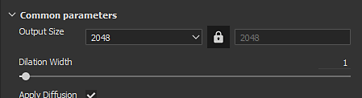

# Substance 3D Painter

烘焙視窗可以透過貼圖集設定（Texture Set Settings[&#128279;](https://experienceleague.adobe.com/en/docs/substance-3d-painter/using/interface/texture-set/texture-set-settings)）進入。點擊名為「**烘焙網格貼圖**」的按鈕，即可開啟目前專案的烘焙視窗。

## 概觀

{width="400px"}

烘烤窗口分為三個主要部分。

### 貝克名單

視窗左上角有幾個按鈕可用。

按鈕旁邊有一個勾選框，勾選後會啟用烘焙過程的烘焙。 那些名字旁邊有圖示的按鈕，代表哪些按鈕需要高多邊形網格。 如果現在有高多邊形，這個圖示會顯示警告。

| *按鈕* | *描述* |
| --- | --- |
| **常見** | 將參數視圖改為 [通用參數](../../../bakers-settings/common-parameters/common-parameters.md)。 |
| **正常** | 將參數視圖改為 [正常參數](../../../bakers-settings/normal-map-from-mesh/normal-map-from-mesh.md)。 |
| **世界太空常態** | 將參數視圖改為 [世界空間法線參數](../../../bakers-settings/world-space-normals/world-space-normals.md)。 |
| **身分證** | 將參數視圖改為顏色 [參數](../../../bakers-settings/color-map-from-mesh/color-map-from-mesh.md)。 |
| **環境遮蔽** | 將參數視圖改為 [環境遮蔽參數](../../../bakers-settings/ambient-occlusion-from/ambient-occlusion-from-mesh.md)。 |
| **曲率** | 將參數視圖改為曲 [率參數](../../../bakers-settings/curvature/curvature.md)。 |
| **職位** | 將參數視圖改為位置 [參數](../../../bakers-settings/position/position.md)。 |
| **厚度** | 將參數視圖改為厚度 [參數](../../../bakers-settings/thickness-map-from-mesh/thickness-map-from-mesh.md)。 |
| **高度** | 將參數視圖改為高度 [參數](../../../bakers-settings/height-map-from-mesh/height-map-from-mesh.md)。 |
| **彎曲法線** | 將參數視圖改為 [彎曲法線參數](../../../bakers-settings/bent-normals-from-mesh/bent-normals-from-mesh.md)。 |
| **不透明度** | 將參數視圖改為不 [透明度參數](../../../bakers-settings/opacity-mask-from-mesh/opacity-mask-from-mesh.md)。 |

### 參數

視窗的這一部分會顯示各種烘焙設定。 其內容會根據當前選擇的烘焙師或常見參數而有所不同。

想了解更多烘焙師設定，請參閱烘焙師設定[&#128279;](../../../bakers-settings/bakers-settings.md)。

### 求助訊息

{width="500px"}

視窗的這一部分會顯示各種與設定相關的提示和說明訊息。 將滑鼠移到設定上即可閱讀該設定的提示。
