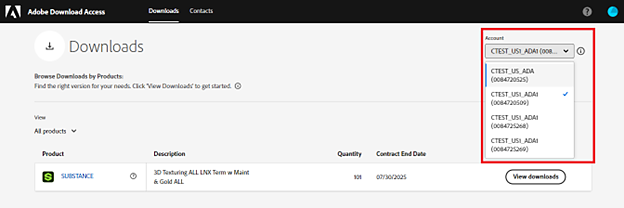
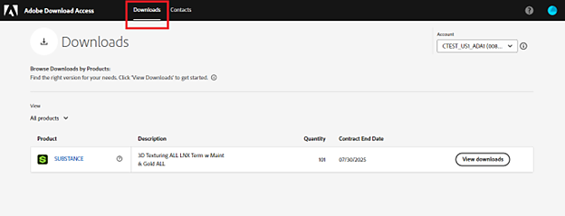

# 部署指南

透過企業合約購買 Substance 3D for Linux® 後，相應的產品與授權會在 Adobe 下載存取（ADA）[&#128279;](https://download-access.adobe.com/lws/downloads)入口網站上提供。你需要同時下載軟體編譯檔和 ADA 的授權金鑰檔案，才能成功部署軟體。

## 下載軟體編譯版與授權金鑰檔案：

登入 [Adobe 下載權限](https://download-access.adobe.com/lws/downloads)。 尋找軟體編譯版與授權金鑰檔案：

1. 請使用帳戶下拉選單選擇你購買 Substance 3D Linux 的帳戶。

   
1. 請在頁面標題中找到連結，前往下載區。

   
1. 點擊對應產品的「檢視下載」。

   
1. ADA 會載入與此 ID 相關的授權資訊，並顯示在下表中。
1. 點擊「數位憑證」一行的「下載」即可下載包含授權金鑰檔案的壓縮檔。

   * 壓縮檔包含每個產品的授權金鑰。
   * 授權金鑰會在你所有授權的機器上啟用該產品。

   
1. 點擊「Substance 3D」取樣器、畫家或設計師，可顯示 Substance 3D 畫家、Substance 3D 設計師及 Substance 3D 取樣器的軟體建置。
1. 點擊「下載」即可下載你想安裝的產品安裝檔案。

   
1. 會跳出「下載軟體」通知。 點擊「接受」

   

## 安裝與啟用

安裝軟體：

1. 雙擊產品的 EXE 檔案即可啟動安裝精靈。
1. 請依照安裝步驟完成安裝。

軟體啟用有兩種選項，本地啟用或網路啟用。

### 地方啟動

1. 解壓從 ADA 下載的壓縮檔。
1. 啟動你想啟用的軟體。
1. 在啟用精靈中，選擇「使用授權金鑰檔案啟用」。

   
1. 點擊「瀏覽」，並指向對應的授權金鑰檔案位置。
1. 點擊「下一步」來啟動軟體。

### 網路啟動

1. 解壓從 ADA 下載的壓縮檔。
1. 將解壓縮的授權金鑰檔案放到共用掛載網路上。
1. 在使用者的電腦上，依照以下頁面說明，設定一個指向授權金鑰檔案的環境變數：

   * Substance 3D 畫家 - <https://experienceleague.adobe.com/zh-hant/docs/substance-3d-painter/using/pipeline-and-integration/configuration/environment-variables>
   * Substance 3D 設計師 - <https://experienceleague.adobe.com/zh-hant/docs/substance-3d-designer/using/pipeline-and-project-configuration/environment-variables>
   * 物質3D取樣器 - <https://experienceleague.adobe.com/zh-hant/docs/substance-3d-sampler/using/pipeline-and-integrations/environment-variables>
