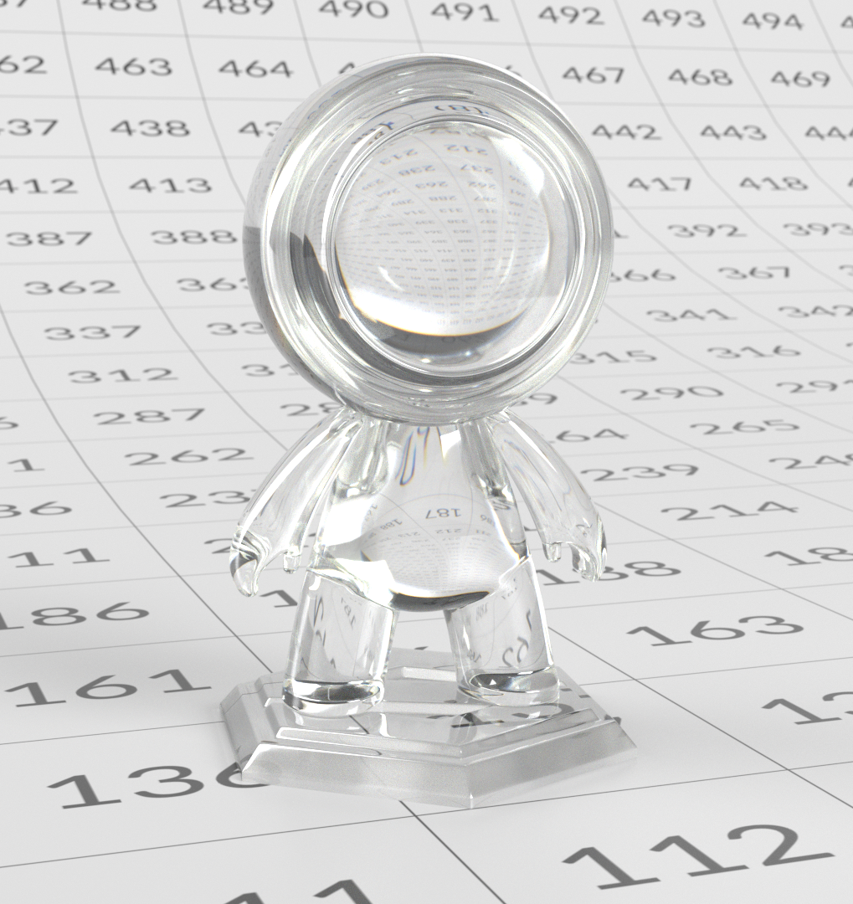

# OpenPBR

[**下載本頁的離線版本。**](../assets/openpbrf/openpbr.pdf)

**OpenPBR** 是一個開放的物理基礎表面著色模型，旨在提供一種一致且可預測的方式，以描述不同 3D 工具、渲染器及管線的材質。 它定義了一個單一且全面的材質模型，能夠代表各種真實世界表面，同時保持足夠彈性，以支持更具風格化或藝術家主導的視覺效果，並使用具有物理意義的參數。

該模型解決了「標準」著色器之間長期存在的不一致，這些著色器名稱相似，但在參數定義與物理假設上各異。 OpenPBR 以物理渲染原理為基礎，從真實光線行為的角度描述材料，強調節能、直覺的參數範圍及穩定的光照反應。 OpenPBR 不規定特定的使用者介面，而是定義材質在根本層級的行為，讓工具能以自己的方式實作模型，同時在資產在應用程式與管線間移動時保持一致的視覺效果。

本文件是一份以藝術家為中心的指南，幫助你理解並使用 OpenPBR。 它說明了模型的基本原理、其組件如何描述現實世界的光行為，以及這些理念如何轉化為實際的材料創造。 本指南並非專注於特定應用，而是針對從事外觀開發、貼圖與渲染等領域的 3D 藝術家，他們希望打造穩健且物理上可信的材質，並在不同軟體環境中保持一致且可轉移。

>[!NOTE]
>
> 如果你已經在使用 OpenPBR 並尋求技術協助， [OpenPBR 常見問題](openpbr-faq.md) 可能已經有你的疑問答案。

*上方 OpenPBR 示範場景由 Nikie Monteleone 創作。 本文件中的範例材質與通道渲染由 Celine Dameron 製作。*

## 互通性與檔案標準

### 與 OpenPBR 共享的物質語言

OpenPBR 的核心目標之一是改善材料在工具間的移動方式。 OpenPBR 並非綁定於單一渲染器或應用程式的著色器，而是定義了 **共享著色模型** ——這是一種描述材質對光線反應的常見方式。

對藝術家而言，這表示 OpenPBR 材質不僅僅是「Adobe 材質」或「Autodesk 材質」，而是描述表面與體積行為的描述，原則上可被多種工具理解。 其目的是，只要某個應用程式中撰寫的資料，只要這些工具支援 OpenPBR 模型，就能在其他地方一致地解讀。

### 資產交換問題

OpenPBR 規範明確承認生產中長期存在的挑戰： **材料在不同應用**&#x200B;間的移動能力不佳。 不同的渲染器通常使用不同的參數名稱、著色假設及底層模型，這使得外觀匹配變得困難且耗時。

OpenPBR 就是為了回應這個問題而設計的。 透過定義一個涵蓋常見生產需求的單一物理接地材料模型——金屬、介電材料、分層材料、透射、散射——提供穩定的交換目標。 雖然這無法保證在所有情況下都能完美匹配，但與專有著色器模型相比，能大幅減少歧義。

對藝術家來說，實際的結論是 OpenPBR 旨在保留 *意圖*。 即使無法精確地視覺上進行平等，材料的結構——什麼是金屬、什麼是透光、表面的粗糙度或各向異性——依然清晰且可轉移。

### 與 MaterialX 的關係

OpenPBR 與 **MaterialX 密切相關，MaterialX** 是一個業界標準框架，用於以不依賴渲染器的方式描述材質與外觀。 OpenPBR 的參考實作存在於 MaterialX 中，這意味著 OpenPBR 材料可以使用已在多條管線中支援的既定交換格式來表示。

這種關係很重要，因為 OpenPBR 本身 **並非檔案格式**。 它定義 *了材料* 的定義，而 MaterialX 則提供標準化的方式來 *在工具間儲存與交換* 材料。 實務上，這允許 OpenPBR 材料嵌入更廣泛的場景描述中，並在支援 MaterialX 的 DCC 與渲染器間共享。

對藝術家來說，這通常是在幕後發生的——但這也解釋了為什麼 OpenPBR 材料在現代流程中越來越被形容為「可攜式」或「互通性」。

### 互通性意味著什麼，以及不代表什麼

對互通性設定現實的期待非常重要。 OpenPBR 並不保證材料在每個應用中都會看起來完全相同。 光照、渲染演算法、色彩管理及功能支援的差異仍可能影響最終影像。

OpenPBR 提供的是一個共同的基準：一套一致的參數與行為、對材料結構的共同理解，以及一條更清晰的路徑，方便工具間的材料轉移而無需從頭重建。

對藝術家來說，這意味著資產在部門或應用程式間移動時較少意外，且工作流程強調耐用的材質邏輯，而非工具特定的技巧。

### 對藝術家的實務啟示

從日常運作角度來看，使用 OpenPBR 鼓勵養成自然支持互通性的習慣：

* 以光的行為為思考，而非應用特定的材料類型
* 使用物理有意義的參數（金屬度、粗糙度、透射率、散射）
* 避免依賴未公開或渲染器專屬的解決方案

即使材料從未離開單一應用程式，這些做法仍符合現代管線標準——隨著工具與渲染器演進，資產更具未來性。

## 材料類型

### 由光相互作用定義的材料

OpenPBR 是一種整體模型（「超級著色器」），旨在代表各種材質類型;這些材質類型會以光線與其互動來描述。 與其以固定預設（如「玻璃」或「皮膚」）來定義材料，每個 OpenPBR 材質都是建立在水平與垂直層疊模型之上，讓藝術家能夠融合完整定義且具物理意義的特性——例如漫反射、鏡面反射、透射、次表面散射與層疊。 這些行為的不同組合自然產生了熟悉的現實物質。

<table>
  <tr style="border: 0;">
    <td style="border: 0;" valign="top"></td>
    <td style="border: 0;" valign="top"></td>
    <td style="border: 0;" valign="top"></td>
  </tr>
</table>

此方法採用固定模型，事先定義分層與混合框架，避免藝術家逐案建立陰影網絡，並讓 OpenPBR 能以一致且物理紮實的方式呈現簡單與複雜材質。

 點擊放大。 *圖示改編自 OpenPBR Surface 規範，Academy © Software Foundation，採用 Apache 授權 2.0*

### 核心材料行為

雖然 OpenPBR 並未強制設定嚴格的材質類型，但大多數現實中的材質可分為幾個廣泛的行為類別。 了解這些類別有助於建立建築材料的穩固心智模型。

### 介電（非金屬）材料

<table>
  <tr style="border: 0;">
    <td style="border: 0;" valign="top"> <em>一個雙晶材料的範例。</em></td>
    <td style="border: 0;" valign="top">介電體是非金屬材料，如塑膠、木材、石頭、布料、橡膠和皮膚。 它們的定義特徵包括：  <ul><li>可見的擴散成分</li><li>大多為無色（白色）鏡面反射</li><li>反射率主要由折射率（IOR）控制</li><li>沒有金屬反射現象</li></ul>  <strong>介電材料的關鍵參數：</strong>  <ul><li>基色定義了材料的整體顏色</li><li>鏡面色彩會影響鏡面高光的色調（在擦過角度時最為明顯）</li><li>鏡面粗糙度控制高光的銳利或模糊呈現</li><li>鏡面重量可調整鏡面高光的整體強度 </li><li>對於介電材料，漫反射主導表面外觀，並由基底色控制。 鏡面反射在法線入射時有限，且在掠射角度會增加，但不會染色。</li></ul></td>
  </tr>
</table>

### 金屬材料

<table>
  <tr style="border: 0;">
    <td style="border: 0;" valign="top"> <em>一個金屬材質的例子。</em></td>
    <td style="border: 0;" valign="top">金屬材料如鋼、鋁、銅或黃金的行為與非金屬（介電）材料本質上不同。 對於金屬而言，外觀幾乎完全由鏡面反射驅動：與介電材料不同，金屬沒有漫反射成分，光線不會在表面下散射，而是直接反射。 它們的定義特徵包括：  <ul><li>沒有漫射成分——顏色完全來自反射</li><li>彩色鏡面反射</li><li>表面細節，尤其是粗糙度，對外觀扮演重要角色</li></ul>  <strong>金屬材料的關鍵參數：</strong>  <ul><li>基底顏色控制反射的顏色</li><li>鏡面粗糙度控制這些反射的銳利或模糊程度</li><li>鏡面重量衡量反射強度</li></ul></td>
  </tr>
</table>

### 基金屬性

基金屬性定義了材料是介電還是金屬——這不僅是視覺上的調整，而是材料底層光反應的改變。

* **0** →完全非金屬（擴散 + 鏡面）
* **1** → 全金屬（僅限鏡面）
* **0–1** →兩種行為的混合。 中間值最適合用於材料混合物，如污垢、腐蝕或磨損表面，而非「部分金屬」材料。

#### 金屬性的實用指引

* 大多數材料都用 **0** 或 **1**
* 混合表面只使用中間值
* 依靠粗糙度和表面細節來塑造金屬外觀。

對於塗漆或塗層金屬、透明及透光材料，應使用層疊（例如塗層）代替降低金屬度。

### 透明與透光材料

透明且透光的材料能讓光線通過。 常見的例子包括玻璃、許多液體，以及透明或有色塑膠。 它們的定義特徵包括：

* 光線從表面進入並從相反一側流出
* 厚度對外觀有很大影響
* 折射率由折射率（IOR）控制，並受表面粗糙度影響
* 折射、吸收、散射與色散塑造最終外觀

透射描述光如何在物體中傳播。 較厚的區域看起來較暗或更飽和，而較薄的區域則較為清晰。 透射色、透射深度、散射色和色散等參數共同作用來控制此行為。

「透明」與「透透」這兩個詞的區別點：「透明」是現實生活中的日常用語;如果我們能看穿某件事，那就是透明的。 「透光」是「半透明」的同義詞。 例如磨砂玻璃允許光線穿透（因此它具有透光性），但它並非透明——我們無法透視。

### 次表層材料

<table>
  <tr style="border: 0;">
    <td style="border: 0;" valign="top"> <em>一個使用次表面散射的材料範例。</em></td>
    <td style="border: 0;" valign="top">地下材料允許光線進入表面，在表面下方散射，並在接近進入點附近再次流出。 常見的例子包括皮膚、蠟、大理石，以及許多有機物質，例如各種食物。 ——水果、蔬菜，或聖內克泰爾起司。 地下材料的定義特徵包括：   <ul><li>柔和、柔和的陰影</li><li>薄片區域的顏色滲出</li><li>外觀取決於厚度</li><li>光線不會穿透物體</li></ul>   次表面散射與透射是不同的。 透射是指光線穿過材料並從相反側離開，而次表面散射則指光進入某表面，在該表面內散射，然後在進入點附近（多數在同一側）離開。 值得注意的是，金屬材料不支持透射或地下散射。 改變完全金屬材料（即基金屬值為1的材料）的透透率或次表面值不會影響其外觀。</td>
  </tr>
</table>

## 材料行為間的融合

現實世界的材料很少是完全純淨的。 許多表面最好被描述為多種行為的混合，而非單一類別。 例如，如果表面出現污垢、磨損或鏽蝕的跡象，不同區域對光的反應會不同。 OpenPBR 支援此功能，允許從表面的一個部分平滑地融合到另一個部分。

### 金屬性作為混合物

<table>
  <tr style="border: 0;">
    <td style="border: 0;" valign="top"> <em>在這種材料中，鐵的金屬性為1，而鏽蝕的金屬性為0。 鐵鏽轉換成鐵的金屬度可能介於中間。</em></td>
    <td style="border: 0;" valign="top">金屬度通常設定為0或1（即完全非金屬或全金屬），但中間值是有意義的。 這些數值代表金屬與非金屬材料在小尺度上混合的表面，例如含有金屬顆粒或薄片的油漆。 此外，如前所述，OpenPBR 材質是由代表不同物理介面的層組成。 材料的基底層（其「核心」層）完全可能是金屬層，但其上方有一層非金屬的 Coat 層——Coat 層不僅是額外的鏡面控制，而是代表一個光必須通過的獨立物理表面。 例如，某些汽車漆類會是金屬片，底層會呈現金屬片狀物，而底層則是透明漆層。</td>
  </tr>
</table>

### 結合圖層以創造複雜的行為

複雜材質，如磨砂玻璃或本節提及的汽車漆面，是透過受控方式結合多種行為而成。 例如：

* **磨砂玻璃**：透射與高粗糙度及散射結合
* **塗漆金屬**：介電表面覆蓋在金屬基底上，通常帶有透明塗層。與其以預設的角度思考，不如考慮存在哪些物理行為，以及它們如何互動。 OpenPBR 材質由具有物理意義的元件定義，這些元件描述光與表面的互動方式。 物質的「類型」是自然地從多種行為組合中產生，而非明確選擇。 透過聚焦光線互動、融合與層疊，藝術家能創造出多元且逼真的材料，同時保持物理上的合理性。

## 與 OpenPBR 合作

### OpenPBR 材質的概念架構

OpenPBR 被設計為單一統一的表面著色模型，能夠代表各種真實世界的材質。 OpenPBR 不需為不同材質類型切換不同著色器，而是將多種表面特性整合成一個分層架構。

從概念上來說，你可以將 OpenPBR 材料視為具備三個關鍵元素：

* **基礎架構**：OpenPBR 認為材料是由物理積木組成，這些積木可以混合（水平混合）或堆疊（垂直分層）。 這些積木對光的反應可能不同。 當兩個這樣的區塊混合時，結果將是兩者反射的混合。 然而，當它們被分層時，最底層的方塊只會接收並反射與最上方方塊通過的光線相等。 這種設計讓藝術家能將素材視為較簡單組成部分的混合體。 這些元件的定義及其位置是第二個關鍵元素：
* **一系列有助於共同框架**&#x200B;的層次：每種材料都會有一個基底層，決定材料的主要顏色，或材料是粗糙還是光滑。 材料也可能有額外的層次——薄膜、塗層和毛絨層——這些層能重現清漆或灰塵等效果。
* **一組面向藝術家的控制**&#x200B;項：一個介面，讓藝術家能控制反射框架的規則——因此也就是 OpenPBR 材料整體的外觀。 根據軟體在使用者介面中如何呈現這些控制，這些基本上是一組旋鈕或滑桿，讓藝術家能控制例如反射強度，或在特定視角下呈現的色調。 有些控制項會套用到整體框架（因此會套用到材質中的所有圖層）;有些控制項只會套用在特定圖層。

### 框架內的材質層

 點擊放大。 *圖示改編自 OpenPBR Surface 規範，Academy © Software Foundation，採用 Apache 授權 2.0*

每一層都帶來特定的物理效果，而材質模型則以物理上合理的方式管理這些層之間的互動。 這種分層結構在 OpenPBR 實作中是一致的。 個別應用程式仍可自由呈現使用者介面，依照其意願控制這些層級。

>[!NOTE]
>
> 有兩個「層」在上圖中未出現：
>
> * **鏡面**：控制表面的光澤或反射性，無論底座是否金屬。 Specular 存在於圖層堆疊中，但本身不是真正的圖層，而是底層和外層層的屬性，這些層確實出現在圖層堆疊中。
> * **幾何：**&#x200B;其他 OpenPBR 圖層決定材質材質，而幾何圖層則定義材質的形狀與存在感，包括不透明度、法線、切線及薄壁行為。
>
> 為了簡化，我們會繼續稱幾何和鏡面為「層」。

構成 OpenPBR 表面的層次，從最深到最外層依次為：

* **基底層**：在 OpenPBR 材質的底部，基底層定義了光與材料之間的基本互動。 基底層的參數決定了材料的主要顏色，是粗糙還是光滑，以及（以光的互動方式而言）是金屬還是非金屬（也稱為介電質）。

>[!NOTE]
>
> 對大多數材料來說，基層是絕對必要的。 其上層（薄膜、塗層與模糊層）可能存在也可能不存在，取決於3D中所重現的材料類型。

* **薄膜**：若存在，則在基底層上方放置薄膜層。 它重現非常薄的表面層的視覺外觀，產生彩虹色，如肥皂泡、燒焦金屬或油膜中所見。

* **外套**：若有外套層，則會重現一層透明且反光的層，位於除模糊外的所有其他層之上。 這可以模擬真實世界的效果，例如清漆、濕滑的表面，或某些類型的汽車油漆。

* **&#x200B;**&#x200B;模糊：若存在模糊層，則可重現微纖維反射。例如，它可以用來重現毛茸茸布料或一層灰塵的外觀。

這些層與光的互動方式由一組參數決定。

### 材料類型

基金屬性進一步決定了材料下一層的特性——完全非金屬的材料與金屬材料具有不同的特性。

#### 非金屬材料（基金屬度 = 0）

完全非金屬的材料（即基金屬值為0的材料）可分為三種基本類型：**漫反射**&#x200B;**、次表面**&#x200B;**或半透明**。請注意，材料不一定只屬於上述某一種基礎類型。 更複雜的材料是這些基本材料類型混合而成的。

**漫射材料** 通常是不透明的材料，如木材或石頭。

**地下物質** 會內部散射光線;例如，皮膚或蠟就屬於這種材料類型。

**半透明的基材** 允許光線通過;這些材料包括玻璃、水晶或某些液體。 需要注意的關鍵參數包括全域鏡面參數、基底層參數，以及下方特定的透射參數。 次表面散射（SSS）和透射的差別在於，SSS不允許你透視材料——光束在材料內散射，然後從同一側返回。 相反地，透射則控制至少部分透明的材料——光束穿過材料。

#### 金屬材料（金屬度> 0）

相反地，當基本金屬性啟用（即其值大於0）時，則會獲得一些特定的行為特徵：

* 材質的鏡面色彩值控制材料接近掠射角度（當光線以接近平行角度照射表面時）的色調。
* 材質的基底色值控制法線入射（即光線以90度角反射於表面時）的反射。
* 材料的鏡面重量值會調整反射的整體強度，影響法線角與掠射角。

結合以下通道，金屬材料能產生各種效果。

**發射**

發射讓表面能直接發出光，作為光源。 雖然發射並非反射現象，但它被納入 OpenPBR 材料模型中，使發射材料能與反射性和透射性特性一同定義。

**薄膜**

<table>
  <tr style="border: 0;">
    <td style="border: 0;" valign="top"></td>
    <td style="border: 0;" valign="top">若存在薄膜效應，則可重現非常薄的表面層的視覺外觀，產生如肥皂泡或油膜中所見的彩虹色。</td>
  </tr>
</table>

**毛皮**

如果有 Coat 層，則會重現一個透明且具反射性的層，位於除模糊外的所有其他層之上。 這可以模擬現實世界的效果，例如清漆或某些類型的汽車油漆。 Coat層的定義範圍介於0到1之間;將此值設為0會完全停用Coat層。

**失真**

可以加裝模糊層來重現類似布料表面的外觀，如天鵝絨或緞面，或用來營造表面上一層灰塵的效果。

### 材料工作流程概念

#### 以輕度行為思考，而非物質標籤

OpenPBR 是根據光線的行為設計，而非固定材質類別。 藝術家不選擇代表「玻璃」、「皮膚」或「金屬」的著色器，而是透過描述光如何從表面反射、穿透、散射或由表面發射來製作材料。 這種方法鼓勵思維轉變：材料不是預先定義的類型，而是多種物理行為的組合。 一個真實材質可能同時包含多種這些行為，OpenPBR 會明確呈現這些貢獻，而非隱藏在預設或不透明的著色模型中。

#### 關注點分離：材料與照明是獨立的

物理基礎工作流程的核心原則之一是將材質描述與照明分離。 材料的撰寫用來描述內在的表面與體積特性，而光照則定義這些特性所展現的環境。 這種分離減少了相互依賴，使複雜場景更易處理。 一個寫得很好的 OpenPBR 素材應該能在各種光照條件下保持可信度，且不需要針對特定場景做調整。 在較小規模上，OpenPBR 延續此理念，保持參數盡可能獨立，讓藝術家能調整材料的某一面向而不無意間破壞其他部分。

#### 建材逐步調整

OpenPBR 鼓勵採用漸進式的材料創作方式。 大多數工作流程會先建立表面反應——即光線如何從物體反射——然後才引入體積效應，如透射或次表面散射。 次級行為，包括模糊、發射或薄膜干涉，通常會在後期層層疊加，以提升真實感或達成特定視覺線索。 這種層次分明的方法幫助藝術家更容易診斷問題，避免在早期就過度複雜化材料。 透過從主要行為建構到次要行為，材料仍更易於理解、除錯與重複使用。

#### 預設與範例作為學習工具

OpenPBR 包含常見材料的預設，但這些最好視為參考範例，而非最終解決方案。 檢視預設如何平衡粗糙度、金屬度或透射深度等參數，有助於藝術家理解特定視覺效果的構建方式。 OpenPBR 工作流程不完全依賴預設，而是鼓勵藝術家觀察真實材質，辨識潛在的光線行為，並利用具物理意義的控制重現這些行為。

## OpenPBR 通道與參數

### 反射

{width="250"}

*一種介電（非金屬）灰色材料，帶有黃色鏡面色。*

+++鏡面參數

**鏡面重量**

鏡面色彩決定掠射角度下反射的色彩色調，而鏡面重量則決定反射強度，範圍介於0到1之間。 在0時，掠射角下完全沒有反射;在較高值時，反射強度會更明顯。 請注意，在「現實世界」中，每種材質在某種程度上都會有反射性，若以三維方式重現，鏡面權重值會大於 0。 同時也請注意，鏡面重量不應被視為參數化材料反射的「主要」值;鏡面粗糙度（見下文）始終是判斷材料反射率的關鍵考量。

<table>
  <tr style="border: 0;">
    <td style="border: 0;" valign="top"> <em>鏡面重量 = 0.0</em></td>
    <td style="border: 0;" valign="top"> <em>鏡面重量 = 0.5</em></td>
    <td style="border: 0;" valign="top"> <em>鏡面重量 = 1.0</em></td>
  </tr>
</table>

**鏡面色彩**

這決定了當光線以掠射角（幾乎與材料表面平行的角度）反射時，反射的顏色色調。 對於金屬材料（見下文的金屬性），可能會施加顏色調色;對於非金屬材料，鏡面色通常應為白色。 下方圖片展示了金屬與非金屬材料上不同的鏡面色彩。

<table>
  <tr style="border: 0;">
    <td style="border: 0;" valign="top"> </td>
    <td style="border: 0;" valign="top"> </td>
    <td style="border: 0;" valign="top"> </td>
  </tr>
  <tr style="border: 0;">
    <td style="border: 0;" valign="top"> <em>綠色鏡面色</em></td>
    <td style="border: 0;" valign="top"> <em>紫色鏡面色</em></td>
    <td style="border: 0;" valign="top"> <em>黃色鏡面色</em></td>
  </tr>
</table>

**鏡面粗糙度**

如同 PBR 材料中的粗糙度參數，OpenPBR 材料中的鏡面粗糙度代表微觀表面變化：即使是肉眼看似光滑的表面，也帶有微小瑕疵，會散射反射光。 此數值重現該效應，透過定義光線反射的銳利程度或寬度，控制表面反射的平滑或粗糙程度。 粗糙度低的材料會產生銳利、鏡面般的反射。 相反地，粗糙度高的材料會產生柔和且模糊的反射。

<table>
  <tr style="border: 0;">
    <td style="border: 0;" valign="top"> <em>鏡面粗糙度 = 0.1</em></td>
    <td style="border: 0;" valign="top"> <em>鏡面粗糙度 = 0.5</em></td>
    <td style="border: 0;" valign="top"> <em>鏡面粗糙度 = 0.8</em></td>
  </tr>
</table>

請注意，這與整體反射光的總量無關——它只是衡量該光是以非常聚焦或漫反射的方式反射的指標。

**IOR（折射指數）**

IOR描述材料與光的強烈互動，控制光線進入材料時的折射（折射）及反射效果，特別是在淺角度（掠射）時。 反光較少的表面，如水或某些塑膠，IOR會較低。 反光較多的表面——例如玻璃或某些寶石——會擁有較高的 IOR 和更強的折射效果。 材料的IOR是一種物理價值，因此是一個客觀數字，而非藝術詮釋的問題。 在製作特定材料時，你只需查詢該材料的IOR，並確保設定正確，確保材料與光線有正確反應。 線上有多種資料列出各種材料的IOR。 例如，花崗岩的 IOR 是 1.43;如果你要製作花崗岩材料，你會輸入這個值作為其 IOR，這樣就能確保光線能以真實的方式反射材料。 請注意，IOR對金屬材料無關（見下文的金屬性）。 改變金屬材料的IOR值不會影響其外觀。

<table>
  <tr style="border: 0;">
    <td style="border: 0;" valign="top"> <em>IOR = 1.1</em></td>
    <td style="border: 0;" valign="top"> <em>IOR = 1.5</em></td>
    <td style="border: 0;" valign="top"> <em>IOR = 2.0</em></td>
  </tr>
</table>

**各向異性**

當微觀表面變化在某種程度上朝同一方向排列時，如溝槽，材料反射會依觀察方向而改變，並垂直於溝槽伸長。 這些溝槽越對齊，效果就越明顯。 材料的各向異性值決定了表面反射在所有方向上是否相同，或是否以特定方式拉伸。 這可能重現像拉絲金屬等材料的效果，因為「刷子效應」的反射時間會長得多。 各向異性反射也可能以更微妙的方式發生，例如拋光表面被指紋塗抹，或是當可變形的表面如乾燥皮膚被拉伸時。

<table>
  <tr style="border: 0;">
    <td style="border: 0;" valign="top"> <em>各向異性 = 0.0</em></td>
    <td style="border: 0;" valign="top"> <em>各向異性權重 = 0.5</em></td>
    <td style="border: 0;" valign="top"> <em>各向異性權重 = 1.0</em></td>
  </tr>
</table>

**各向異性切線**

當存在一定程度的各向異性（即材料的各向異性值大於0）時，各向異性切線指示溝槽的主導方向。 反射會垂直延伸到那個方向。

<table>
  <tr style="border: 0;">
    <td style="border: 0;" valign="top"></td>
    <td style="border: 0;" valign="top"></td>
    <td style="border: 0;" valign="top"></td>
  </tr>
</table>

*各向異性切線的不同取向。*

+++

### 幾何

OpenPBR 也包含影響材質與幾何結構互動的參數，例如不透明度與薄壁行為。 這些控制決定表面應被視為物理厚度，還是薄殼，這對於紙張、樹葉、窗戶或布料等材料尤為重要

+++幾何參數

* **薄壁**：啟用薄壁後，材料被視為顯微鏡下非常薄。 光線被認為能在無可見折射的情況下穿過材料。
* **不透明度**：決定是否能部分或完全透視材料。 請注意，雖然傳輸參數定義材料的透明度，但不透明度參數可用來定義網狀（netting）——本質上是「移除」材料資訊以產生孔洞。

+++

### 底層

在 OpenPBR 模型的底部，基底層代表光與表面材料本身之間的基本互動。 底層由四項特性定義：基重、基底顏色、金屬度及漫反射粗糙度。

<table>
  <tr style="border: 0;">
    <th style="border: 0;"></th>
    <td style="border: 0;" valign="top"></td>
  </tr>
</table>

*黃色介電材料和金屬材料並排存在。*

+++基底層特性

* **基底重量**：基本上定義基色的強度（見下文），範圍從0到1,0時主要呈現黑色材料（無色），1時是最大紅、綠、藍光組合。

<table>
  <tr style="border: 0;">
    <td style="border: 0;" valign="top"> <em>基准重量 = 0.0</em></td>
    <td style="border: 0;" valign="top"> <em>基礎重量 = 0.5</em></td>
    <td style="border: 0;" valign="top"> <em>基礎重量 = 1.0</em></td>
  </tr>
</table>

* **基底色**：此顏色決定材料的「主色」，決定金屬基底及漫反射（非金屬基底）的反照率——即反射的紅、綠、藍光量。 如前所述，基底色彩決定反射的顏色，而基底權重設定決定反射強度。

<table>
  <tr style="border: 0;">
    <td style="border: 0;" valign="top"></td>
    <td style="border: 0;" valign="top"></td>
    <td style="border: 0;" valign="top"></td>
  </tr>
</table>

* **金屬性**：定義材料在0-1尺度上是非金屬（介電）還是金屬性質（0=介電，1=完全金屬且不透明）。

<table>
  <tr style="border: 0;">
    <td style="border: 0;" valign="top"> <em>金屬度 = 0.5</em></td>
    <td style="border: 0;" valign="top"> <em>金屬度= 1.0</em></td>
    <td style="border: 0;" valign="top"> <em>金屬度 = 1.0，底色為黃色</em></td>
  </tr>
</table>

* **漫反射粗糙度**：定義材料的微觀表面粗糙度，範圍從0（具有非常平滑且均勻的反射）到1（具有非常粗糙且漫反射的範圍），適用於岩石或樹皮等材料。

<table>
  <tr style="border: 0;">
    <td style="border: 0;" valign="top"> <em>漫反射粗糙度 = 0.0</em></td>
    <td style="border: 0;" valign="top"> <em>漫反射粗糙度 = 1.0</em></td>
    <td style="border: 0;" valign="top"> <em>0.0 與 1.0 的並排比較</em></td>
  </tr>
</table>

+++

### 地下

{width="250"}

*一種利用地下通道的材料。 請注意手部及網格其他薄處的半透明感。*

+++地下參數

* **次表面重量**：定義使用多少次表面散射——基本上是進入材料的光量。

<table>
  <tr style="border: 0;">
    <td style="border: 0;" valign="top"> <em>權重 = 0</em></td>
    <td style="border: 0;" valign="top"> <em>重量 = 0.5</em></td>
    <td style="border: 0;" valign="top"> <em>重量 = 1.0</em></td>
  </tr>
</table>

* **次表面顏色**：定義任何從材料表面下重新出現的光的整體顏色。 較淺的顏色通常會導致更明亮且更明顯的散射;此處黑色值則完全沒有次表面散射效果。

<table>
  <tr>
    <td></td>
    <td></td>
    <td></td>
  </tr>
</table>

* **次表面半徑**：定義光線在物質內部能行進多遠，直到被散射或吸收。 當光值較低時，光只能傳播較短的距離;因此材料呈現密集的外觀。 半徑越大，光線能傳播得更遠;材料呈現柔軟、蠟質狀且半透明的外觀。

<table>
  <tr>
    <td> <em>半徑 = 1</em></td>
    <td> <em>半徑 = 10</em></td>
    <td> <em>半徑 = 20</em></td>
  </tr>
</table>

* **次表面半徑尺度**：控制平均自由程的色彩通道依賴性。 換句話說，就是每個RGB通道中光線在被吸收或散射前獨立通過材料的距離。 這產生了在次表面材料中常見的特徵色彩變化：在網格較薄且光線傳播距離較短的區域，顏色會向半徑最長的通道移動。

預設值（1， 0.5， 0.25）表示紅光會穿得最深，接著是綠光，然後是藍光，這與許多現實世界地下材料（包括皮膚）的行為非常接近。

<table>
  <tr>
    <td> <em>半徑刻度 = 預設</em></td>
    <td> <em>半徑刻度 = 灰色</em></td>
    <td> <em>半徑刻度 = 白色</em></td>
    <td> <em>半徑刻度 = 黃色</em></td>
    <td> <em>半徑刻度 = 棕色</em></td>
  </tr>
</table>

* **次表面各向異**&#x200B;性：定義光線在次表面材料內偏好散射的方向。 當光為0時，光會均勻向各個方向散射。 當正值時，光線會傾向向前散射，方向與初始光線相同;這通常會使材料呈現更清晰、更半透明的外觀。 當值為負時，光線會傾向向光束來源向後散射;這通常會使材料看起來更不透明且密度較高。

<table>
  <tr>
    <td> <em>各向異性 = -1</em></td>
    <td> <em>各向異性 = 0</em></td>
    <td> <em>各向異性 = 1</em></td>
  </tr>
</table>

+++

### 傳輸

透射控制光線能通過材料的量。 與地下不同，透射控制物體整體通過的光量，而地下層則控制物體內部反射回表面的光量。

{width="250"}

*一個高度透光性材料的橘色透射器範例。*

+++傳輸參數

* **重量**：控制光線能通過材料表面的量。 通常用於透明材料，如液體或玻璃。

<table>
  <tr style="border: 0;">
    <td style="border: 0;" valign="top"> <em>重量 = 0.0</em></td>
    <td style="border: 0;" valign="top"> <em>重量 = 0.5</em></td>
    <td style="border: 0;" valign="top"> <em>重量 = 1.0</em></td>
  </tr>
</table>

* **顏色**：決定光線通過材料的顏色。

<table>
  <tr style="border: 0;">
    <td style="border: 0;" valign="top"></td>
    <td style="border: 0;" valign="top"></td>
    <td style="border: 0;" valign="top"></td>
  </tr>
</table>

* **深度**：以公分計，指光線在透射色達到完全飽和度前，必須穿過材料的距離——基本上是指光線通過透明（或部分透明）材料時，吸收顏色的速度。 對於透射深度較低的材料，光線會很快獲得顏色，即使是材料中非常薄的部分也會呈現強烈的顏色。 相反地，在較高深度時，較厚的部分看起來會非常暗或幾乎不透明，且材料呈現「密集」的外觀，如同彩色樹脂或濃稠液體。

<table>
  <tr style="border: 0;">
    <td style="border: 0;" valign="top"> <em>深度 = 0</em></td>
    <td style="border: 0;" valign="top"> <em>深度 = 1</em></td>
    <td style="border: 0;" valign="top"> <em>深度= 10</em></td>
  </tr>
</table>

* **散射顏色**：定義在透明或部分透明材料內散射的光的顏色與強度。 它本質上定義了材料內部的「混雲度」，決定光線如何在材料內擴散和柔化。 散射色彩適合重現光線不潔淨或不直線的材料，例如某些塑膠、牛奶或混濁的蘋果汁——甚至適用於大型水體（例如製造海洋的藍色調）。

<table>
  <tr style="border: 0;">
    <td style="border: 0;" valign="top"> <em>深灰色散射色</em></td>
    <td style="border: 0;" valign="top"> <em>中間灰色散射色</em></td>
    <td style="border: 0;" valign="top"> <em>白色散布色</em></td>
  </tr>
</table>

* **散射各向**&#x200B;異性：這決定了光在材料內部傾向於散射的方向。 當值為0時，光會均勻散射到各個方向。 當正值時，光線會傾向向前散射，方向與最初的光線相同;這通常會使材料呈現更清晰、更玻璃般的外觀。 當值為負時，光線會傾向向光束來源向後散射;這通常會使材料呈現較為結霜或粉筆狀的外觀。

<table>
  <tr style="border: 0;">
    <td style="border: 0;" valign="top"> <em>各向異性 = -1</em></td>
    <td style="border: 0;" valign="top"> <em>各向異性 = 0</em></td>
    <td style="border: 0;" valign="top"> <em>各向異性 = 1</em></td>
  </tr>
</table>

>[!NOTE]
>
> 散射各向異性取決於光的方向，因此這種散射的結果會根據光源相對於被點亮的材料的位置而改變。

* **色散（Abbe）：**&#x200B;定義光線在通過透明材料時彎曲的程度，導致色彩分裂、彩虹狀條紋或折射光中彩色邊緣。 散布（Abbe）值為0則完全失效。 低色散（Abbe）值會導致色彩分離非常明顯（如你在稜鏡中看到的），而高色散（Abbe）值則會導致色彩分離較弱或可忽略不計，整體折射更乾淨清晰。 （色散（Abbe）參數以19世紀物理學家及光學工程師恩斯特·阿貝命名。）

<table>
  <tr style="border: 0;">
    <td style="border: 0;" valign="top"> <em>Abbe = 20</em></td>
    <td style="border: 0;" valign="top"> <em>Abbe = 45</em></td>
  </tr>
</table>

* **透射色散**：與其他地方的重量參數相同，此值定義材料內光線擴散的強度。 這在高對比度折射的邊緣最為明顯。

<table>
  <tr style="border: 0;">
    <td style="border: 0;" valign="top"> <em>傳輸色散 = 0</em></td>
    <td style="border: 0;" valign="top"> <em>透射色散 = 0.5</em></td>
    <td style="border: 0;" valign="top"> <em>傳輸色散 = 1.0</em></td>
  </tr>
</table>

+++

### 放射

發射控制材料是否會自行發光（獨立於反射光），並讓你設定發射光的顏色和強度。

{width="250"}

*一種明亮的綠色發射物質。*

+++發射參數

* **亮度**：定義材料發出光的亮度，單位為 cd/m²，也稱為 nits。 此測量假設白光;改變光的顏色（見下文）可能會影響整體亮度。

<table>
  <tr style="border: 0;">
    <td style="border: 0;" valign="top"> <em>亮度 = 100</em></td>
    <td style="border: 0;" valign="top"> <em>亮度 = 400</em></td>
    <td style="border: 0;" valign="top"> <em>亮度 = 1000</em></td>
  </tr>
</table>

* **顏色**：決定材料發出的光色。

<table>
  <tr>
    <td></td>
    <td></td>
    <td></td>
  </tr>
</table>

+++

### 薄膜

{width="250"}

*一種帶有薄膜層的深色底材。*

+++薄膜參數

* **重量**：與其他重量參數相同，這控制薄膜效應的強度，值介於0到1之間。 接近0時，薄膜效應幾乎看不見;在這個範圍的高端，薄膜效應更為明顯。

<table>
  <tr style="border: 0;">
    <td style="border: 0;" valign="top"> <em>權重 = 0</em></td>
    <td style="border: 0;" valign="top"> <em>重量 = 0.5</em></td>
    <td style="border: 0;" valign="top"> <em>重量 = 1.0</em></td>
  </tr>
</table>

* **厚度**：定義薄膜層的厚度，單位為微米。 在物理精確的材料中，大多數薄膜效應發生在0至1微米的厚度間。

<table>
  <tr>
    <td> <em>厚度 = 0</em></td>
    <td> <em>厚度 = 0.5</em></td>
    <td> <em>厚度 = 1.0</em></td>
  </tr>
</table>

* **折射率（IOR）：**&#x200B;如前所述，材料的 IOR 決定材料與光的反應強度。 OpenPBR 材料的薄膜層有其自身的 IOR。 例如，鑽石的 IOR 是 2.417。

<table>
  <tr>
    <td> <em>IOR = 1</em></td>
    <td> <em>IOR = 1.5</em></td>
    <td> <em>IOR = 2</em></td>
  </tr>
</table>

+++

### 塗層

{width="250"}

*一層低粗糙度的紫色外層。*

+++毛皮參數

* 重量：基本上決定了被毛層的強度。 將此值設為最低值 0 會完全停用該層;數值越高，層層強度越高。

<table>
  <tr style="border: 0;">
    <td style="border: 0;" valign="top"> <em>權重 = 0</em></td>
    <td style="border: 0;" valign="top"> <em>重量 = 0.5</em></td>
    <td style="border: 0;" valign="top"> <em>重量 = 1.0</em></td>
  </tr>
</table>

* 顏色：決定整體外套層的顏色，這會使底層反射的顏色變色。

<table>
  <tr>
    <td></td>
    <td></td>
    <td></td>
  </tr>
</table>

* 變暗：決定底層反射的暗度與飽和程度。 例如，上漆的木材通常看起來比未上漆的木材更深;暗化特性可以重現此效果。

<table>
  <tr>
    <td> <em>變暗 = 0</em></td>
    <td> <em>變暗 = 0.5</em></td>
    <td> <em>變暗 = 1.0</em></td>
  </tr>
</table>

* 折射率（IOR）：本質上是根據光在外層內的行為，數值定義非金屬表面的反射性。

<table>
  <tr>
    <td> <em>IOR = 1.4</em></td>
    <td> <em>IOR = 2</em></td>
    <td> <em>IOR = 3</em></td>
  </tr>
</table>

* 粗糙度：如討論基底層時提到的，表面粗糙度定義了表面的反射率——光滑表面能均勻反射光線，而粗糙表面則會將光線隨機散射。 一層 Coat 層會有其獨特的粗糙度。

<table>
  <tr>
    <td> <em>粗糙度 = 0.1</em></td>
    <td> <em>粗糙度 = 0.5</em></td>
    <td> <em>粗糙度 = 0.8</em></td>
  </tr>
</table>

>[!NOTE]
>
> 請注意，即使基底層是光滑的（即粗糙度值接近0），Coat層的粗糙度仍可能讓整體材料看起來更粗糙。

* 各向異性：各向異性描述了塗層的反射會隨方向變化，使高光沿著表面拉伸或對齊，而非呈現圓形。 此效應用來表示塗層中的方向性表面結構，如刷刷、條紋或流動模式。

<table>
  <tr>
    <td> <em>各向異性 = 0.1</em></td>
    <td> <em>各向異性 = 0.5</em></td>
    <td> <em>各向異性 = 1.0</em></td>
  </tr>
</table>

* 各向異性切線：上述各向異性值所導致的任何拉伸或條紋方向。

<table>
  <tr>
    <td> </td>
    <td> </td>
    <td> </td>
  </tr>
</table>

*各向異性切線的不同取向。*

* 塗層法線：塗層可進行少量變形，以呈現細微比例的幾何外觀。 例如，這可以用來重現刮痕或雨滴在材料上的外觀。

+++

### 失真

{width="250"}

*這個例子顯示毛髮（黃色）在斜視角度時最為明顯。*

+++失真參數

* **Weight**：與其他Weight參數相同，這控制Fuzz效果的強度，值介於0到1之間。 在 0 時，Fuzz 層完全被禁用。

<table>
  <tr>
    <td> <em>重量 = 0.0</em></td>
    <td> <em>重量 = 0.5</em></td>
    <td> <em>重量 = 1.0</em></td>
  </tr>
</table>

* **顏色**：決定模糊效果的顏色。

<table>
  <tr>
    <td></td>
    <td></td>
    <td></td>
  </tr>
</table>

* **粗糙度**：基本上決定了該層中「模糊粒子」的形狀。 當此值接近0時，粒子高且細;從淺（擦掠）角度觀察表面時，粒子更為明顯。 在較高的數值下，粒子會更接近球形;它們更容易從更廣泛的角度被看到，因此整體表面看起來更粗糙。

<table>
  <tr>
    <td> <em>粗糙度 = 0.1</em></td>
    <td> <em>粗糙度 = 0.5</em></td>
    <td> <em>粗糙度 = 1.0</em></td>
  </tr>
</table>

+++

## 材料創作的最佳實務

本節著重於實務指引，如何利用現代統一的 PBR 模型（如 OpenPBR）打造穩健且可預測的材質，使其在光照條件、場景與工具間表現良好。 也就是說，以下許多建議適用於 PBR 材料的一般製作;但部分仍依 OpenPBR 材料的具體功能集而有所不同。

### 從現實世界的參考開始

物理基礎的材料在基於真實觀察時最為可靠。 盡可能以照片參考、測量值或直接觀察相似表面來決定材料。 這不僅適用於顏色，也適用於粗糙度、反射率和表面變化。 參考資料有助於將材料固定在合理範圍內，使其更容易重複使用，且對光線或環境變化的敏感度較低。 同時也減少了為了補償材料內部光線問題而產生的誘惑。

### 要有個關於材料物理結構的心理模型來撰寫

OpenPBR 不僅僅是一串參數，讓藝術家可以調整各種效果直到達到想要的效果。 其核心依賴於一個基礎結構，詳見《OpenPBR 材料層的概述》，假設材料具有類似的物理分層結構。 因此，建議在撰寫材料時，同時考慮此模型，並以 OpenPBR 參數描述這些材料的物理元素。 考慮材料的成分——在顯微鏡下垂直切片會是什麼樣子，顏色和高光的來源，等等。 盡量預測哪些 OpenPBR 元件是達成理想外觀所必需的。 同樣地，也可以反過來嘗試——從一組層次組成材料，並發現其最終的外觀。

### 作者資料獨立於燈光之外

PBR 工作流程的一大優勢是將材質與照明之間的關注分開。 材質應該描述表面特性，而非補償場景光線、曝光或氛圍。 目標是創造在各種光線條件下——即使是光線不佳——都能保持穩定且可信的材料。 這種分離讓場景更容易管理、除錯與反覆修改——尤其是在較大的管線中，材質與光影可能由不同藝術家負責。 在各種情境中驗證材料非常有幫助。 一個精心設計的素材應該能在不同的光線環境、比例和鏡頭角度下經得起考驗。 如果可能，請在多個情境下預覽素材——例如在中性攝影棚燈光下或較戲劇化的場景中。 這有助於揭示材料外觀是否真正符合其參數，或是依賴特定設定才能看起來正確。 能在不同情境中良好驗證的材料更容易重複使用，且在生產中更可靠。

### 盡可能保持參數解耦

現代PBR工作流程旨在減少參數間的隱藏依賴性。 在調整粗糙度、金屬度或透光率等數值時，目標應是只影響材料外觀的特定面向。 實務上，這意味著：

* 除非有明確的物理理由，否則避免從單一材質推動多種視覺效果。
* 偏好簡單且易讀的參數設定，而非緊密連結的網路。
* 逐步進行改變，盡可能單獨評估其影響。 這種方法讓資料更容易理解、更容易除錯，且在其他情境中重複使用時更具預測性。

### 有意識地使用分層

層疊材質很有力量，但同時也增加了複雜度。 每一層額外的資料都會增加視覺和計算成本，也讓材料更難推理。 分層時：

* 使用圖層來表示真實的表面結構（例如，材料表面上的灰塵或污垢）。
* 避免堆疊產生相似視覺效果的層。
* 定期評估某層是否對最終造型有實質貢獻。 捕捉表面本質特性的簡單材料通常比難以控制的高層次材料更堅固。

### 注意性能、雜訊與穩定性

某些材質特徵與組合本質上較昂貴或容易產生雜訊，尤其是在路徑追蹤渲染器中。 材質中使用的特徵越多，渲染成本通常越高。 地下、高粗糙度結合透射、多層效應、各向異性或色散，都可能增加渲染時間與變異。 雖然這些功能很有價值，但使用時應該謹慎——視藝術家的設備而定，可能會造成過度雜訊、不穩定或長時間渲染。 了解使用進階功能的成本，並在提供清晰視覺價值的地方使用它們非常重要。

### 有意偏離物理合理性

雖然物理上合理的數值提供了堅實的基準，但生產現實有時需要刻意偏離。 風格化、可讀性、美術指導或技術限制，可能正當化將參數推向現實範圍之外。

具體適合的情節會因專案、素材和藝術意圖而大相逕庭——而辨識這些時刻本身就是判斷問題，而非遵循規則。 重要的是偏離是刻意且有目的的：你要明白你偏離的是哪個物理原理，以及為何這對工作有益。

其目標不是破壞物理原理，而是有意識地彎曲它們，以服務於明確的藝術或技術目標。

## 常見問題及避免方法

### 用預設思考而非光明行為

在物理基礎工作流程中，一個常見的陷阱是將材料視為預先定義的「外觀」，而非光線行為的描述。 這通常表現為過度依賴預設值或複製參數值，卻不了解其代表什麼。

OpenPBR 的設計核心是明確的光互動——反射、透射、散射、吸收與發射。 當材料看起來不正常時，最有效的故障排除方法是找出這些行為中哪一個是原因，並直接調整。 這會比單純切換預設或堆疊效果，做出更清晰的決策和可預測的結果。

### 使用鏡面重量代替鏡面粗糙度

要控制材質的反射率，可能會先調整鏡面權重，但更常見的做法是調整鏡面粗糙度參數。

所有材料都有鏡面反射，而鏡面反射在掠射角時總是趨向100%。 此外，大多數介電（非金屬）材料在正常入射時的鏡面反射率非常相似，介於2%到8%之間。 表觀反射率差異的主要原因其實來自材料的微觀幾何形狀;這由鏡面粗糙度參數定義。

不過，鏡面重量仍可作為局部折射率調整、模擬微遮蔽反射率變化，或後期藝術調整的簡寫方式。

### 混淆透射、透明度與地下散射

光線通過效果通常被大致歸類為「透明」或「半透明」，但 OpenPBR 對它們有明確區分。 透射指的是光線穿過材料並從相反側離開，如玻璃、水或透明塑膠中所見。 次表面散射描述光線進入材料內部，並在不同點散射，產生柔和的陰影與內部色彩。

在物理層面上，有兩種現象在起作用：散射，使牛奶看起來是白色的;以及吸收，使咖啡看起來是黑色的。 當散射極少或沒有散射時，體積看起來較為透明，透射率是關鍵特徵。 當散射量大時，體積看起來會比較反光，而次表面是關鍵特徵。 透過將參數推至極端值，可以讓地下看起來透明，透射看起來不透明，但效率會非常低。

在更適合透射的地方使用次表面散射，或反之，可能導致材料過於複雜且渲染效率低。 OpenPBR 將這些行為分開，讓藝術家能選擇最符合參考的，或在需要時有意結合。

### 在沒有明確視覺動機的情況下新增功能

由於 OpenPBR 能揭露廣泛的材料行為——包括塗層、模糊、薄膜效應、次表面散射與發射——同時啟用多種特徵很容易產生誘惑。 若沒有明確的參考來源，會讓材料更難控制且視覺上產生雜訊。

更可靠的做法是從最簡單的材料開始，且與觀察到的表面或體積行為相符，然後只有在缺少特定視覺線索時才加入複雜度。 每一個額外的特徵都應該對應參考中可見的事物，例如邊緣的纖維或體積內的顏色變化。

### 單一燈光設定的製作材料

物理基礎的工作流程旨在減少材質與光照之間的依賴，但當材質只在特定設定下調整為正確時，問題就會發生。 如果一種材料需要特定的光強度或角度才能看起來可信，它通常是在補償光線，而非描述材料本身。

在不同光照條件下測試材料，可判斷其是否堅固或過於依賴場景。 以這種彈性為考量的材料，往往能更順暢地跨越不同環境與專案整合。

### 使用無參考的極端參數值

雖然 OpenPBR 參數有物理意義，但若無明確意圖將其推向極端值，可能會導致不穩定或混淆的結果，尤其是在光線變化時。 當材料行為異常時，將參數選擇與現實世界參考比較，有助於判斷問題是藝術意圖還是參數誤用。 以參考資料作為決策基礎，使資料更容易診斷、精煉並持續維護整個專案。

### 誤解模型的限制

並非所有材料都能被 OpenPBR 代表。 像任何材質模型一樣，OpenPBR 只是一個模型。 雖然它已經相當豐富，但與現有或想像中無限豐富且豐富的材料相比，仍顯得粗糙。 有些材料模型可以直接代表，有些需要更多經驗才能製作，且能將模型拉到極限，還有一些模型無法代表的。 在某些情況下，技術嫻熟的藝術家仍能透過一些「作弊」獲得不錯的成果;這通常是在做出非物理選擇的時候。 但了解模型能做什麼、不能做什麼，以及何時需要替代方案，例如更簡單的材質或專用著色器，是很重要的。

### 期待材質模型能解決渲染問題

並非所有視覺問題都源自材料本身。 雜訊、緩慢收斂或陰影失真可能是光照、取樣或渲染器設定所致，而非 OpenPBR 材質定義。

雖然 OpenPBR 提供了物理上一致的材質模型，但它並不能取代適當的光照與渲染設定需求。 隔離變數——例如在簡化照明下測試材料——有助於判斷問題出在材料本身還是其他地方。

### 預設作為學習工具，而非最終答案

OpenPBR 預設最好被理解為參考和學習工具。 檢視預設值——如金屬度、粗糙度、各向異性或透射深度——有助於釐清具體視覺結果的構建方式。

依賴預設作為最終解決方案，可能會模糊材料的實際運作方式。 將它們作為起點或分析範例，有助於更深入理解並更具彈性地創作材料。

## 參考資料與附錄

### 參考文件

關於權威定義、實作細節及技術重點規範，請參考以下來源：

* [Academy 軟體基金會 – OpenPBR](https://academysoftwarefoundation.github.io/OpenPBR/)
* [Autodesk OpenPBR 文件（Arnold）](https://help.autodesk.com/view/ARNOL/ENU/?guid=arnold_user_guide_ac_surface_shaders_ac_open_pbr_html)
* [Maxon OpenPBR 文件](https://help.maxon.net/r3d/3dsmax/en-us/Content/html/Material+OpenPBR.html#StandardMaterial-Base)

這些資源應被視為技術準確性及執行特定行為的主要參考資料。

## 附錄一：什麼是PBR？

物理基礎渲染（PBR）是一種基於簡單理念的渲染方法：材質不應依賴特定的光照配置，而是應以符合真實表面行為的方式對光線的反應。 PBR 材料設計得適合多種環境，使其更具可預測性、可重複使用性，且在現代生產流程中更易管理。

這種現實世界的紮根直接結果是，PBR工作流程讓藝術家能夠複製現實，以實際測量為準，而非試圖猜測近似。 在燈光方面，這可能意味著使用物理單位和現實世界的強度，而非任意的數值。 在與攝影或影片內容整合的渲染工作流程中，物理基礎的相機與著色器有助於保留真實鏡頭與感測器的視覺特性。 對於材料，同樣的原理也使得像攝影測量等技術得以實現，因為兩者都以相同的物理假設描述，因此掃描的表面可以無縫地與手動製作的材料混合。

對藝術家而言，PBR 提供工具、引擎與渲染器之間的共享視覺語言。 採用PBR原則製作的材質，無論是在即時引擎、路徑追蹤渲染器，或是在截然不同的光照條件下觀看，都能呈現一致的視覺效果——而不必不斷手動調整。 這種一致性是PBR成為遊戲、視覺特效與視覺化標準的關鍵原因。

PBR的核心是建立在幾個關於光與表面的基本物理觀念之上。 光線被視為反射、散射或被表面吸收的能量，著色器設計用來保存這些能量，避免材料看起來異常明亮或反光。 表面外觀受微觀粗糙度等因素影響，這些粗糙度會影響反射的銳利度或柔和度。 PBR工作流程也明確區分金屬與非金屬，因為這些材料類型與光的互動方式根本不同。 PBR 依賴描述物理屬性的參數——如基色、粗糙度和金屬度——著色器會利用物理衍生模型來解讀這些參數。

同樣重要的是，PBR 促進渲染過程不同部分之間的低依賴性。 透過將材質定義與光影分離，藝術家避免每次光線變化都必須「修正」材質。 這種分割將複雜的問題簡化成更小且易於管理的問題：光照可以獨立於材質調整，且材質可以在不了解最終場景設定的情況下自行撰寫。 在更細緻的尺度上，現代 PBR 模型——包括 OpenPBR——致力於保持參數盡可能獨立，讓藝術家能單獨調整數值而不產生意外副作用。

實務上，PBR 將藝術家的角色從補償光影或渲染器的怪異性轉向以真實世界特性描述材料。 結果是工作流程重視一致性，而非場景特定調整，真實感自然來自明確的材質輸入，而非手工製作的燈光技巧。

欲了解更多PBR技術細節，請參閱 [Wes McDermott](https://www.adobe.com/learn/substance-3d-designer/web/the-pbr-guide-part-1)所著《PBR指南》。

## 附錄二：什麼是 OpenPBR？

OpenPBR 是一個開放的物理基礎表面著色模型，旨在提供一種一致且可預測的方式，描述不同 3D 工具、渲染器與管線中材質的外觀。 它定義了一個單一且全面的材質模型，能代表各種真實世界表面，同時仍能靈活呈現更具奇幻性或藝術性地的表面，並使用物理有意義的參數。

OpenPBR 的核心目標是解決 3D 工作流程中長期存在的問題：工具與渲染器間材質不一致的問題。 歷史上，藝術家會使用多個「標準」著色器，這些著色器在精神上表現相似，但在細節、參數意義及物理假設上因軟體或渲染器而異。 即使兩個著色器在「粗糙度」或「金屬度」等參數上名稱相同，結果也不總是一致。 這使得在工具間移動資產、跨團隊與工作室協作，或在複雜流程中維持視覺連續性變得困難。

這些限制在 3D 社群中普遍存在，藝術家、工作室與開發者開始尋找解決方案。 起初，這個社群持續的努力逐漸趨向共同解決方案。 這項工作，以及圍繞其進行的眾多討論與共同決策，都是在一個統一的材料創建方法下正式化：OpenPBR，一個通用且公開文件化的材質模型，可以跨應用程式一致實作。OpenPBR 並非綁定於單一軟體，而是建立在一個共享的基礎上，不同工具可以在保留相同的底層物理行為的同時繼續發展。 這種共通模式讓藝術家更容易在應用程式間轉移素材，工作室能標準化外觀開發流程，且資產在製作過程中能保持視覺穩定。 最重要的是，OpenPBR 本質上是一個共識;即使在今天，這個討論仍在持續，且在做決策時會尋求 3D 領域各領域的廣泛專家共識。

該模型本身基於物理基礎渲染（PBR）的原理。 這表示材料的描述是基於光與現實世界表面的互動，強調能量守恆及對光的可預測反應，參數根植於現實光學，這些光學的組織與曝光方式支持實際外觀開發，而非科學模擬。 也就是說，OpenPBR 定義了材質本身的行為——參數的意義、不同層之間的互動，以及材質在光照下的反應。 各軟體工具可以自由以不同方式呈現這些控制項，使用最適合的使用者介面風格，只要底層材質模型保持一致——不過實務上，參數的命名、分組與排序背後有其邏輯，且特定應用程式大多會尊重這些規則。

## 附錄三：OpenPBR 計畫的背景與動機

要理解 OpenPBR 為何存在，有必要檢視過去十年來物理著色的演變。 隨著 PBR 成為業界標準，大多數主要 3D 工具都推出了自己的表面著色器。 這些著色器在意圖上大致相似：它們旨在用節能的反射模型來呈現真實材料，並以藝術有意義的方式將參數暴露給底層物理模型，例如底色、粗糙度、金屬度等。

這過程經過多次迭代，3D 領域最初非常分散，各方利害關係人探索不同的視覺表達方式，並在不同領域取得進展。 一種解決方案逐漸被另一種取代，直到特定方法被認為更優越，不同領域的研究開始趨同，最終催生了GGX、金屬粗材料方法，最終發展成OpenPBR。

同時，生產管線變得更加互聯。 資產越來越需要在建模、貼圖、外觀開發、燈光、渲染及即時使用等應用程式間移動。 工作室開始更依賴標準化的交換格式，如 USD 和 MaterialX，且明顯允許專門移動素材描述的格式也會帶來優勢。

OpenPBR 計畫即為回應這些挑戰而成立。 它代表了 Adobe 與 Autodesk 合作的成果，並由 Academy Software Foundation（ASWF）支持，旨在定義一個單一且開放的表面著色模型，作為跨工具共享的參考點。 OpenPBR 整合並形式化了藝術家已熟悉的物理基礎渲染概念;這些概念接著構成一個統一模型的基礎，並具有明確定義的行為。

OpenPBR 背後的一個主要動機是一致性。 此處的目標是確保使用 OpenPBR 描述的素材在實施地點都能以可預測的方式表現，同時不犧牲藝術控制權或創意彈性。 當藝術家調整粗糙度、金屬度或鏡面反應時，預期這些改變在合規實作中會有相同的視覺意義。

另一個重要的動機是耐用性。 OpenPBR 透過公開指定並作為產業標準來治理，設計上能隨時間演進，而不受單一產品或公司的生命週期或優先順序所限制。 這讓它成為長期資產創建更穩定的基礎，特別是對於希望素材在工具變化中仍能保持可用性與相關性的工作室和藝術家來說。