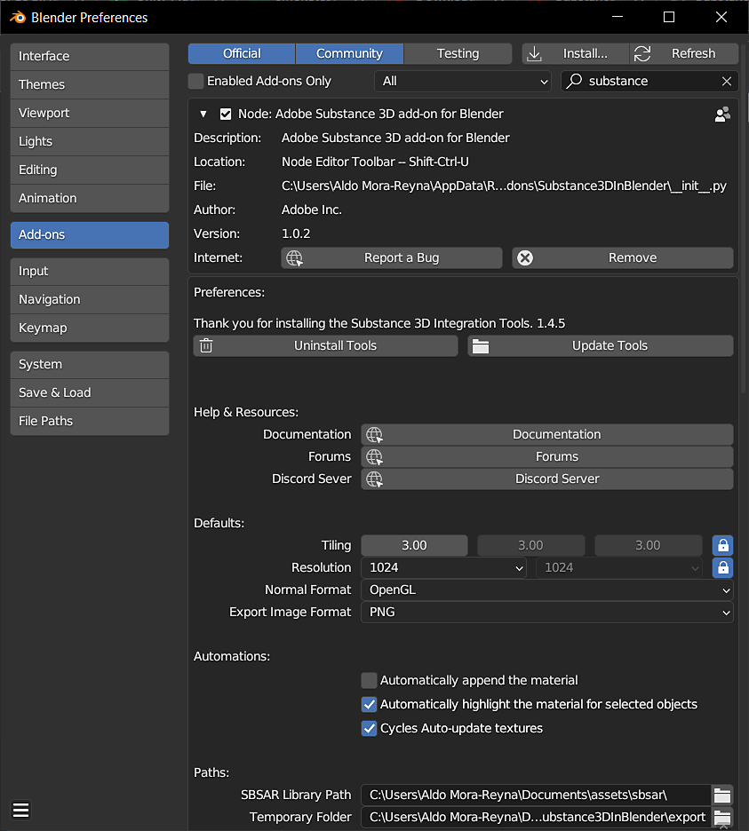

# Blender 中的物質概述

## 外掛概述

Substance 3D 外掛可以讓你把 Substance 材質匯入 Blender。 透過 Substance 3D 面板，你可以在同一地點管理並自訂專案中的 Substance 材料。 這個外掛會從 .sbsar 檔案產生貼圖，並用來製作 Blender 材質。 當 Substance 參數調整時，這些材質會自動更新。

## 物質進口

1. 點擊 **Substance 3D面板中的載入** 按鈕。
1. 在打開的視窗中，導覽到存放 .sbsar 檔案的位置，選擇一個或多個。 然後點擊 **載入物質（Load Substance Material** ）按鈕。
1. 點擊材質面板中的球體圖示，打開下拉選單並選擇你的物質材質。 這樣會將素材分配到目前的槽位。 或者，你可以在Substance 3D面板裡的「套用」按鈕，將材料分配到一個不會覆蓋現有分配的新素材槽。

>[!NOTE]
>
> 如果物件沒有材質，套 **用** 按鈕會自動附加物質材質。

## 物質3D面板

Substance 3D 面板用於管理專案中的 Substance 材料，並調整其個別參數。 圖參數區塊有材質解析度、平鋪、隨機化和預設的控制。 輸出區塊有生成材質的影像格式控制。 物質參數區塊為其中 ，其中 是可調整物質參數的地方。

欲了解更多資訊，請參閱 [Substance 3D 面板](../../../3d-applications/blender/the-3d-panel/the-substance-3d-panel.md) 頁面。

## 偏好設定

預設行為和其他設定可在附加元件偏好設定中調整。 「自動附加材質」可啟用，以自動將物質材質附加於物件上，並覆蓋目前的材質分配。 「自動高亮選取所選物件的材質」會在 Substance 3D 面板中更改高亮材質，若選取該材質物件。 啟用「Cycles 自動更新貼圖」後，可以在使用 Cycles 渲染視圖時，更新 3D 視埠中的貼圖。

位移可透過輸出區塊中的高度切換來啟用。 在這裡你也可以調整每個輸出的檔案格式和位元深度。

更多資訊請參閱 [偏好設定](../../../3d-applications/blender/preferences/preferences.md) 頁面。

<table>
<tr style="border: 0;">
<td style="border: 0;" valign="top">

</td>
<td style="border: 0;" valign="top">

</td>
<td style="border: 0;" valign="top">

</td>
</tr>
</table>

## 尋找更多物質材料

數千個專業製作的素材及其他資產可於 [Substance 3D 資產頁面](https://helpx.adobe.com/tw/substance-3d/unlisted/assets.html)下載。 社群免費分享的更多資源可在 Substance 3D 社群資產頁面找到[&#128279;](https://helpx.adobe.com/tw/substance-3d/unlisted/community-assets.html)

## 社區

如需一般協助、回饋或回報缺陷，請加入Substance Discord伺服器的 [&#128279;](https://discord.com/invite/substance3d)#substance-blender-beta頻道或[Adobe社群](https://community.adobe.com/t5/substance-3d-plugins/ct-p/ct-substance-3d-plugins?page=1&sort=latest_replies&lang=all&tabid=all&topics=label-blender)。
