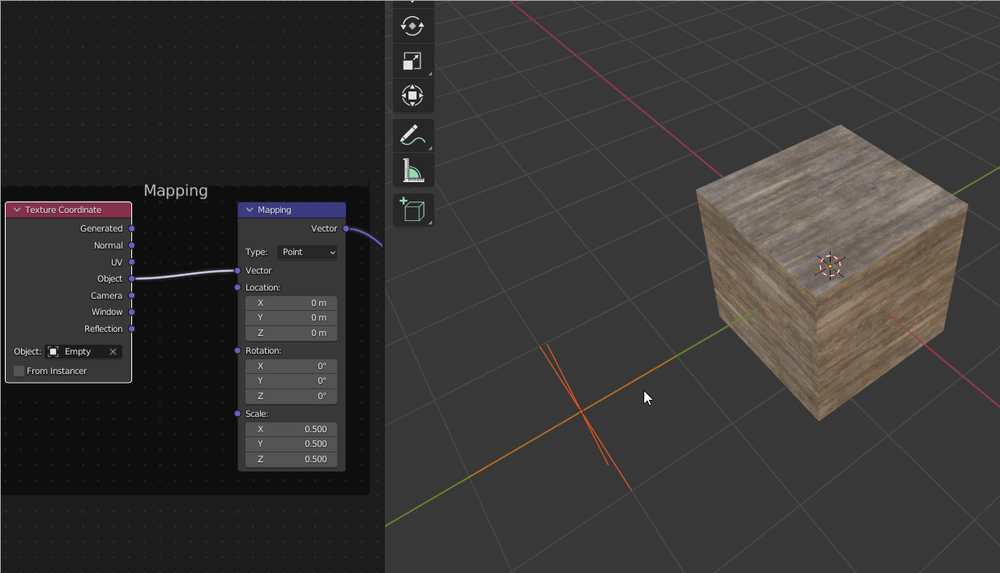

# Blender 中的實體尺寸

物質材料的物理尺寸允許根據材料在世界中的大小進行縮放。 尺寸會在 Substance 應用程式如 Designer 中設定，並顯示在插件面板的實體尺寸區塊中。

啟用實體尺寸後，材質會根據其真實世界的公分大小來鋪設。 材質平鋪無論物件的比例大小都會保持不變。 此功能可透過切換至附加面板中的實體尺寸著色器來啟用。 調整物件縮放後，應該用 ctrl/cmd+A 套用縮放，才能準確地平鋪物理大小貼圖。

## 調整實體尺寸

映射節點中的數值可以調整，以藝術性地控制實體大小平鋪。 此外，像 Empty 這樣的物件可作為材質座標輸入，以控制材質映射，並透過輸入物件的轉換（見下方範例）。

