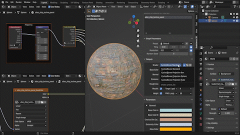

# 工作流程

## 與自行車合作

預設情況下，參數變更在 Cycles 渲染視圖中不會自動更新於 3D 視口。 要在 Cycles 渲染檢視中看到更新，請在偏好設定中啟用 **Cycles 自動更新貼圖** 以強制更新。

## 多圖 .sbsar 檔案

該附加元件支援帶有多個實體圖的 .sbrar 檔案。 當載入包含多個圖表的檔案時，Substance 3D 面板上會出現新的「圖表」下拉選單。 與其他參數變更不同，切換圖形不會自動更新材料。 因此， **在更換圖表後，必須使用「應用** 」按鈕重新指派材料。

>[!NOTE]
>
> 預設情況下，「套用」按鈕會將材料新增到新欄位，且不會覆蓋先前的材料分配。 移除先前的材料，或使用材料下拉選單重新分配新加的材料。

## 與影像輸入的操作

使用允許自訂影像輸入的 Substance 材質時，Substance 3D 面板的影像選擇參數會讓你開啟檔案瀏覽器（資料夾圖示）或從專案中已有的圖片（圖片圖示下拉選單）中選擇。

可使用匯出影像格式偏好設定，將 Blender 內產生的影像輸入儲存到暫存資料夾。 更多細節請參閱 [偏好設定](../../../3d-applications/blender/preferences/preferences.md)頁面。

## 著色器網路預設。

著色器預設可以透過Substance 3D面板輸出區塊的下拉選單快速調整。 這些著色器預設會調整影像貼圖的套用方式。Cycles/Eevee Standard 使用一般的 UV 貼圖座標映射。 另外三種 Cycles/Eevee 投影預設則使用生成的材質座標映射，用於方框、球體或圓柱投影方法。

材質所使用的預設著色器預設可在附加元件 [偏好設定](../../../3d-applications/blender/preferences/preferences.md)中選擇。

## 濾波與輸出調整

Substance 3D 面板的輸出區也有過濾輸出的選項。 著色器預設下拉選單旁的三個按鈕可用來篩選啟用輸出（勾選）、著色器輸出（球體）及所有可用輸出（行線）。

輸出可透過勾選框逐一啟用。 當輸出啟用時，貼圖節點群組中會建立對應的輸出。 如果該輸出被 Principled BSDF 材料節點支援，該節點會自動連接到該節點。 高度會連接到位移節點，環境遮蔽會與 MixRGB 節點的基底顏色結合。\
勾選標記旁的檔案格式下拉選單可用來設定輸出貼圖儲存的檔案類型。

此外，預設的檔案輸出偏好設定也可以在附加功能 [偏好](../../../3d-applications/blender/preferences/preferences.md)設定中更改。

## 物件材質交換

點擊 Blender 材質屬性面板中的球體圖示，即可開啟 Blende 專案中的材質清單。 小組中已產生的物質材料也會出現在清單中。 從此清單中選擇材料，將取代該材料槽中的活性材料。

## 置換

Cycles 渲染器支援網格與材質的位移，但在 Eevee 中卻沒有。 要看到位移，請確保 Height 輸出已啟用。 這個外掛會自動將材質的位移設定設為 **位移和凸起**。 現在在渲染視圖中，觀看物件材質會顯示位移。 位移比例可在材質面板或位移節點調整。

為了獲得最佳效果，對於位移細節複雜的材質，建議使用更高的細分層級或高多邊形網格。
