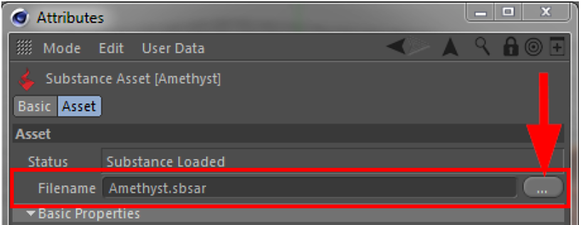

# 屬性管理器

Cinema 4D 的屬性管理器中新增了物質資產模式。

當在物質資產管理器中選擇某個物質時，屬性管理器會自動切換到實體資產模式。 你也可以在屬性管理器的模式選單中手動切換到這個模式。

在 Substance 資產模式中，你可以存取 Substance 的所有輸入，也能看到所有輸出通道的總覽。

{width="500px"}

## 物質輸入的分組

若某物質的輸入被分組，這些分組會在屬性管理器中顯示。 有兩個預設的群組： **基本屬性** 與 **影像輸入**。

* 在基本屬性群組中，所有未在 Substance Designer 中指派給群組的輸入都會顯示。
* 顧名思義，所有連結到外部影像的物質輸入都會被收集在影像輸入群組中。

## 檔名參數

透過屬性管理器中的 Filename 參數，可以在 Substance 資產載入場景後更改其檔案位置。

{width="500px"}

這不僅有助於重新定位 Substance 檔案，也適用於將 Substance 與完全不同的 Substance 交換時。

此時會詢問使用者是否應該將先前 Substance 輸出通道的既有參考重新映射到新的 Substance。

{width="500px"}

如果問題被回答為「否」，所有 Substance 著色器中指向先前 Substance 的連結將會被刪除。 為了重新映射輸出通道，外掛會先搜尋同類型且名稱相同的輸出通道。

## 參數三態

若同時選取多個物質，這些物質間共享的輸入會顯示為三態，並可同時編輯所有選擇物質（就像 Cinema 4D 中其他參數一樣）。

在這些情況下，輸出通道會如下所示顯示。

{width="300px"}
