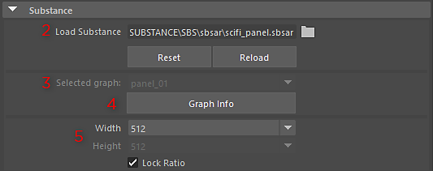
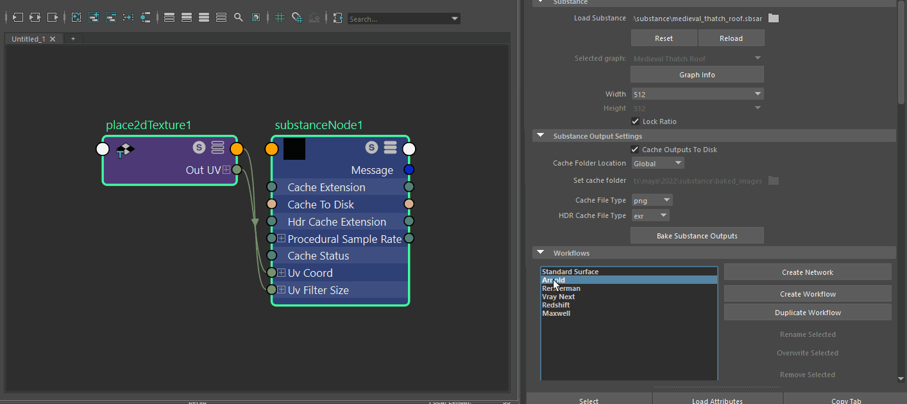

# 瑪雅中的物質概述

## 外掛概述

Substance 插件允許你直接在 Maya 載入在 Substance Designer 中建立的 Substance 材質。 這個插件會建立一個 Maya 材質，並將物質材質貼圖輸入到材質通道的輸入中。 你可以修改物質參數，貼圖會自動更新。

>[!NOTE]
>
> 確保你在設定/偏好設定 ->Maya 外掛管理器中已載入該插件

## 打開物質

1. 打開 Hypershade，在節點編輯器裡，右鍵點擊並向上滑動標記選單，選擇建立節點。 這會開啟「建立節點」視窗。 接著你可以搜尋物質節點。

   

   你也可以在節點編輯器裡按 Tab，然後在文字欄位輸入 substance，這樣就會篩選到物質選項。 從選項中選擇物質質地。
1. 選擇 Substance 節點，在屬性編輯器中瀏覽以載入 Substance （.sbsar） 檔案。

   
1. 如果該物質包含多個圖表，選取圖下拉選單會自動顯示。 所選的圖表將用於製作素材。
1. 圖譜資訊按鈕會顯示 Substance Designer 中設定的圖屬性。
1. 解析度可從寬度與高度下拉選單中選擇。 鎖定配給預設是啟用的。
1. 啟用快取輸出到磁碟，以便將物質輸出烘焙到磁碟，以便能與像 Arnold 這類渲染器一起使用。 快取檔案會由外掛透過 Maya 檔案節點讀取回來。

   
1. 選擇你使用的渲染器的工作流程，然後點擊「建立著色器網路」按鈕。 為渲染器工作流程建立著色器網路。 你現在可以在場景中套用素材。

   {width="1000px"}
