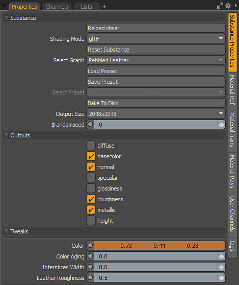

# 參數

物質有一組核心參數。 這些參數分為內容（Substance）、輸出（Outputs）和微調（Tweaks）。 這些資料可在物質特性面板中找到。\
Substance Source 的 Substance 會包含技術參數與通道。 在 MODO 裡，頻道選項沒有影響。 輸出功能可透過輸出區段啟用或停用。

{width="300px"}

## 內容

一個實體有一組核心參數，可以在實體屬性面板的物質類別中找到。

* **重新裝填物質：** 這個參數允許你重新裝填物質。 它是設計用來搭配Substance Designer使用的。 如果你正在製作自訂物質，並且新增了新的調整或輸出，你可以將新發佈的物質重新載入到 MODO。 新的調整和輸出會被加入，而之前的調整設定會保留。
* **著色模式：** 這個參數讓你可以設定著色模式來用於物質。 Principled（預設）、Unreal、Unity 或 glTF。
* **重置物質：** 此參數會將調整調整重置為預設設定。
* **選擇圖表：** 允許你在Substance檔案中選擇從哪個圖表中創建材料。
* **載入預設：** 你可以載入預設，來設定 Substance 調整參數。 預設可以用 Substance Player 建立。 預設檔案為 .sbsprs 檔案類型。 載入預設後，你需要點選預設下拉選單，因為 .sbsprs 可以包含多個預設。
* **儲存預設：** 允許你儲存預設
* **選擇預設：** 允許你選擇 Substance 檔案中嵌入的預設，或從 MODO 中儲存的預設中選擇。
* **烘焙到磁碟：** 此參數會將 Substance 產生的貼圖烘焙成點陣圖檔案。
* **輸出大小：** 此參數會動態調整貼圖大小至尺寸設定。 Substance Engine 會將貼圖重新生成到所需的大小。
* **隨機種子：** 此參數會改變物質的程序生成。 這個參數非常適合用來創造同一物質的隨機版本。 它讓你能快速調整 Substance 參數，產生新的材質版本

## 輸出

輸出選項允許你啟用或關閉物質輸出。 輸出是 Substance Engine 產生的，並在 Shader 樹中以貼圖形式呈現。

{width="300px"}

## 調整

調整是 Substance 檔案中撰寫並在 MODO 中可編輯的參數。 你可以選擇頻道，在道具模式下使用 Channel Haul 來在彈出式控制器中取得所有控制。

{width="300px"}
