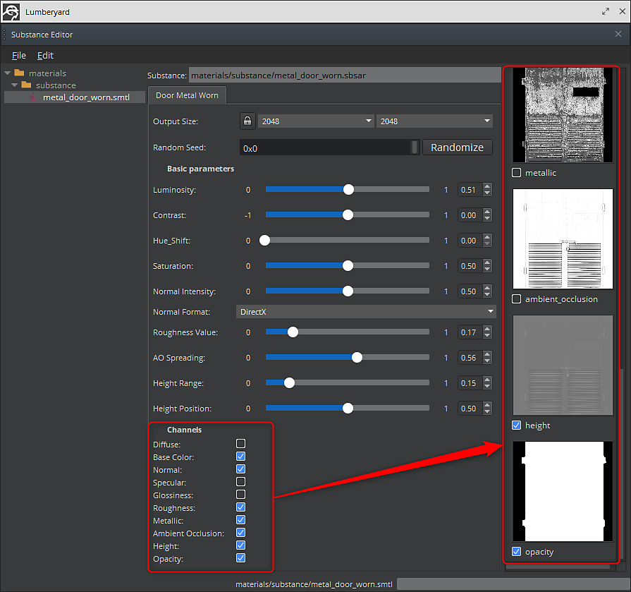

# 參數與輸出

你可以使用程序性材質編輯器來更改物質的參數。 對話框的左欄列出了這些物質。 對話框中間欄列出所選物質的參數，右側欄則顯示該物質的輸出。 輸出可以透過點擊勾選框按鈕來啟用或停用。

1. 打開程序性資料編輯器並選擇該物質。 選擇左欄的物質。 參數會載入在中間欄，並與該物質的相關輸出一同載入在最右欄。

   
1. 你也可以啟用預設未啟用的其他 Substance 輸出來建立材質。

   
1. 調整完成後，務必用 File>Save 儲存材質設定。
