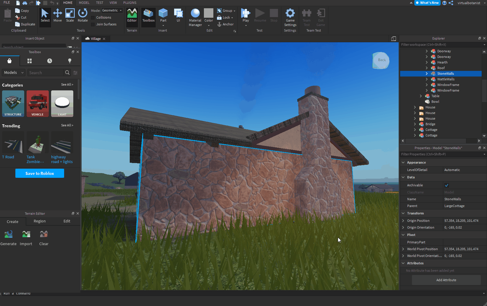

# Roblox

[Roblox](https://www.roblox.com/) 是一個沉浸式 3D 多人遊戲體驗的平台。 Roblox Studio 這個 Roblox 設計工具支援 PBR 金屬粗糙度工作流程。

<table>
<tr style="border: 0;">
<td width="58.30%" style="border: 0;" valign="top">

## Substance 3D Designer 範本

要為 Roblox 製作貼圖，你可以使用下方的 Substance 3D 檔案作為 [Substance 3D Designer](https://experienceleague.adobe.com/en/docs/substance-3d-designer/home) 中的 [Substance 合成圖表範本](https://experienceleague.adobe.com/en/docs/substance-3d-designer/using/substance-graphs/substance-compositing-graphs)。

[{width="64px"}](https://helpx.adobe.com/content/dam/roblox.sbs)

此圖形範本允許預先設定最終材質檔案名稱與類型。 此範本可安裝並重複使用，以製作始終遵循 Roblox 素材指引的新素材。

</td>
<td width="41.60%" style="border: 0;" valign="top">

{width="200px"}

</td>
</tr>
</table>

## 設計師到 Roblox 的工作流程

<table>
<tr style="border: 0;">
<td style="border: 0;" valign="top">

### 安裝範本

首先， *安裝* Roblox 範本。

* 下載上面連結的範本檔案。
* 前往 Designer 的使用者文件目錄：
* （Creative Cloud 桌面版） `/Documents/Adobe/Adobe Substance 3D Designer`\
  （蒸汽） `/Documents/Allegorithmic/Substance Designer/`
* 建立一個範本資料夾。
* 把檔案放進那個資料夾。

</td>
<td style="border: 0;" valign="top">

{width="512px"}

</td>
</tr>
</table>

<table>
<tr style="border: 0;">
<td style="border: 0;" valign="top">

### 偵測模板

然後，讓設計師 *監控* 模板資料夾，尋找圖表範本。

* 在 Designer 裡，請到 **編輯>偏好設定...**
* 在 [偏好設定](https://experienceleague.adobe.com/en/docs/substance-3d-designer/using/workspace/preferences/preferences-window) 視窗中，請前往 **「專案」>「使用者專案」>「一般」**
* 在 **範本目錄** 列表中，點擊 **+** 鍵
* 進入 `templates` 目錄並點選 **「選擇資料夾」**
* 點擊 **確定** 鍵
* 前往 **檔案>新的>物質圖表......**
* 請檢查該範本是否`Roblox`列在新物質圖表[&#128279;](https://helpx.adobe.com/substance-3d/unlisted/documentation/sddoc/create-a-graph-102400068.html)視窗的模板列表底部

</td>
<td style="border: 0;" valign="top">

{width="512px"}

</td>
</tr>
</table>

<table>
<tr style="border: 0;">
<td style="border: 0;" valign="top">

### 匯出材質

用 Roblox 的範本做一個圖表，完成素材後再從該圖表匯出點陣圖。

* 在[新物質圖](https://helpx.adobe.com/substance-3d/unlisted/documentation/sddoc/create-a-graph-102400068.html)視窗中，選擇範本`Roblox`
* 設定圖表的識別碼和其他參數，然後點擊 **確定**
* 在圖表檢視[&#128279;](https://experienceleague.adobe.com/en/docs/substance-3d-designer/using/workspace/graph-view/the-graph-view)中處理你的材料——請參考[這裡](https://experienceleague.adobe.com/en/docs/substance-3d-designer/using/getting-started/workflow-overview)了解如何工作流程的起點
* 完成後，請到&#x200B;**圖檢視&#x200B;*工具列中的工具 > 匯出點陣圖***
* 在[匯出點陣](https://experienceleague.adobe.com/en/docs/substance-3d-designer/using/substance-graphs/exporting-bitmaps)圖視窗中，設定有效的&#x200B;**目的地**&#x200B;路徑，確保&#x200B;*所有*&#x200B;輸出都已&#x200B;**&#x200B;勾選，然後點選&#x200B;**&#x200B;匯出**
* 檢查貼圖是否正確匯出到 **目的地** 路徑

</td>
<td style="border: 0;" valign="top">

{width="512px"}

</td>
</tr>
</table>

<table>
<tr style="border: 0;">
<td style="border: 0;" valign="top">

### 在 Roblox 中創作素材

在 Roblox 裡，建立一個材質變體，並指派從 Designer 匯出的材質。

* 選擇模型&#x200B;**&#x200B;**&#x200B;標籤，點選&#x200B;**材料管理器**
* 選擇一個 *材質範本* ，然後點擊 **建立變體** 按鈕
* 在 **Create 變體** 視窗中，為材質設定名稱
* 對於 *每個材質通道*，點擊 **匯入** 按鈕，選擇從 Designer 匯出的對應材質
* 點擊 **儲存**

</td>
<td style="border: 0;" valign="top">

{width="512px"}

</td>
</tr>
</table>

<table>
<tr style="border: 0;">
<td style="border: 0;" valign="top">

### 塗抹材料

在你的 Roblox 場景中使用你的新素材變體

* *在你的 Roblox 場景中選擇* 任何零件或網格
* 在材質管理器&#x200B;**中**，選擇你的&#x200B;*材質變體*，然後點擊&#x200B;**「套用到選取零件**」按鈕

>[!NOTE]
>
> 如果 Roblox 材質材質的顏色看起來不同，請在材質變體套用物件屬性的 Appearance 類別中檢查 **Color** 屬性&#x200B;**，並確保它設定為&#x200B;*純白色*——例如 RGB（255， 255， 255），在 Roblox 中標示&#x200B;*為機構白*。**

</td>
<td style="border: 0;" valign="top">

{width="512px"}

</td>
</tr>
</table>

<table>
<tr style="border: 0;">
<td style="border: 0;" valign="top">

### 調整鋪磚

材料在表面上的重複程度——即鋪磚——可以隨時調整。

* 在材質管理器&#x200B;**中**，選擇你的&#x200B;*材質變體*，然後點擊&#x200B;**編輯**&#x200B;按鈕
* 在&#x200B;**「編輯變體**」視窗中，調整&#x200B;**「新增**」下的&#x200B;**「每格**&#x200B;釘數」屬性值——值越&#x200B;*低*&#x200B;會重複&#x200B;*越多*

</td>
<td style="border: 0;" valign="top">

{width="512px"}

</td>
</tr>
</table>
