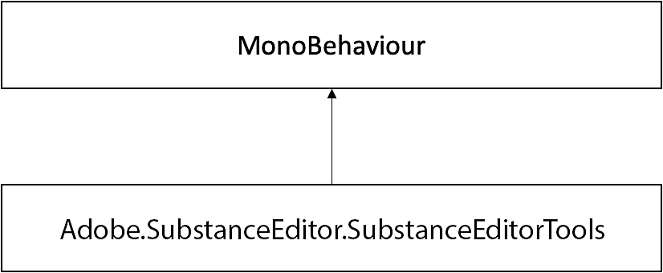

# SubstanceEditorTools

## Adobe.SubstanceEditor.SubstanceEditorTools 類別參考

使用者可在編輯器腳本中使用的工具與工具。

Adobe 的繼承圖。SubstanceEditor.SubstanceEditorTools：



### 靜態公共成員功能

```
• static void SetGraphFloatInput (SubstanceGraphSO graph, int inputId, float value)
```


設定圖形浮點點數輸入。

```
• static void SetGraphFloat2Input (SubstanceGraphSO graph, int inputId, Vector2 value)
```


設定 graph float2 輸入。

```
• static void SetGraphFloat3Input (SubstanceGraphSO graph, int inputId, Vector3 value)
```


設定圖形 float3 輸入。

```
• static void SetGraphFloat4Input (SubstanceGraphSO graph, int inputId, Vector3 value)
```


設定 graph float4 輸入。

```
• static void SetGraphIntInput (SubstanceGraphSO graph, int inputId, int value)
```


設定 graph int 輸入。

```
• static void SetGraphInt2Input (SubstanceGraphSO graph, int inputId, Vector2Int value)
```


設定 Graph int2 輸入。

```
• static void SetGraphInt3Input (SubstanceGraphSO graph, int inputId, Vector3Int value)
```


設定 int3 輸入圖。

```
• static void SetGraphInt4Input (SubstanceGraphSO graph, int inputId, int value0, int value1, int value2, int value3)
```


設定圖 int4 輸入。

```
• static void SetGraphInputString (SubstanceGraphSO graph, int inputId, string value)
```


設定圖形串輸入。

```
• static void SetGraphInputTexture (SubstanceGraphSO graph, int inputId, Texture2D value)
```


設定圖形紋理輸入。

```
• static void RenderGraph (SubstanceGraphSO graph)
```


渲染目標圖形並更新其資產。

```
• static string CreatePresetFromCurrentState (SubstanceGraphSO graph)
```


從圖形物件的當前狀態建立預設的 XML。

```
• static List< SubstanceGraphSO > GetGraphs (this SubstanceFileSO fileSO)
```


回傳與 SubstanceFileSO 相關聯的 SubstanceGraphSO 清單。
