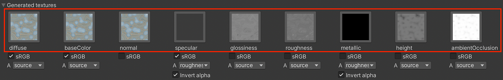

# 產生材質（打包）

生成的材質顯示物質引擎計算出來的輸出，用以產生材質。 這些材質會輸入到著色器輸入。 預設情況下，著色器只會建立基底輸入。 如果啟用「Generate All Outputs」，所有材質都會顯示在這裡。

當「產生所有輸出」被啟用時

## 使用情況

1. 選擇貼圖圖示會在專案視窗中選擇該貼圖。 這對執行時材質不適用，因為貼圖不會在專案資料夾中產生。
1. sRGB 按鈕的運作方式類似於材質匯入設定中的 sRGB（色彩材質）選項。 它允許你設定貼圖是要在伽瑪空間（sRGB）中解讀還是線性。 Substance 外掛會自動處理這個詮釋，但如果需要也可以覆寫。

   | 物質輸出 | sRGB |
   | --- | --- |
   | 基本顏色 | 啟用 |
   | 擴散 | 啟用 |
   | 反射 | 啟用 |
   | 正常 | 失能 |
   | 金屬 | 失能 |
   | 粗糙度 | 失能 |
   | 光澤度 | 失能 |
   | 高度 | 失能 |
   | 環境遮擋 | 失能 |

## 包裝通道

你可以透過下拉選單將一個貼圖打包到另一個貼圖的 alpha 通道中。 每個產生的材質都有一個下拉選單，列出所有由物質材質產生的材質輸出。 只要從清單中選擇一張貼圖，將其打包到材質的 alpha 通道中即可。 Source 選項是材質的 alpha 通道。

在這張圖片中，我選擇了高度圖：

在下一張圖片中，你可以看到高度輸出被壓縮在基底色彩貼圖的 alpha 通道中。

## 輸出貼圖

此外，輸出材質可以透過輸出材質映射區塊，個別指派給 Unity 材質的表面輸入。 .sbsar 產生的輸出材質會顯示在左欄，而可用的 Unity Surface 輸入則顯示在右欄。 後者可以透過下拉選單更改。

