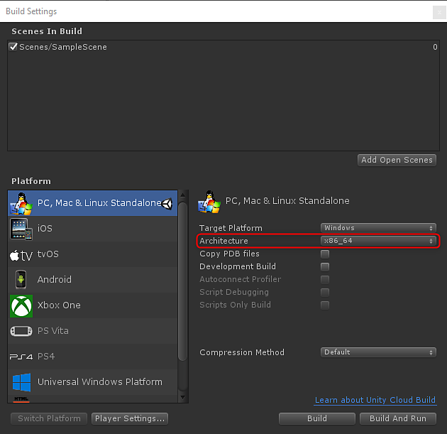

# API 概述

## 內容。遊戲

```
Using Substance.Game
```


Substance.Game 是包含用於腳本的類別的組合語言。 這些類別如下：

**內容。遊戲。****內容**：參考SBSAR

**Substance.Game.SubstanceGraph**：SBSAR 中的個別圖。*（曾在 Unity 2017 中稱為 ProceduralMaterial）*

## 腳本製作流程

1. 建立一個 SubstanceGraph 的實例
1. 在圖實例上設定參數。
1. 排隊 Substance 進行渲染：QueueForRender（） 會將 Substance 圖加入隊列。 此清單將由下一次呼叫 RenderAsync 或 RenderSync 處理。

### 圖實例參數

```
// panel color 

mySubstance.SetInputColor("paint_color", color); 

 

// panel size 

mySubstance.SetInputVector2("square_open", panelSize); 

 

// wear level 

mySubstance.SetInputFloat("wear_level", wearLevel);
```


引號中的值是 Substance Designer 中設定的參數識別碼。

在 Unity Inspector 中，你可以將滑鼠移到參數上，顯示 Substance Designer 中識別碼集合名稱的提示。


### 排隊讓 Substance 進行渲染

```
// queue the substance to render 

mySubstance.QueueForRender(); 

 

//render all substances async 

Substance.Game.Substance.RenderAsync();
```


>[!NOTE]
>
> 目前，我們只支援 x86\_64 架構。 你需要在建置設定中設定 x86\_64


