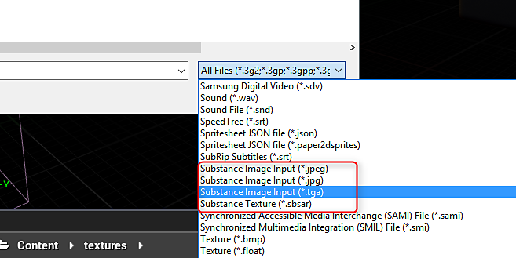

# Substance 輸入影像 - UE4

Substance 可以透過輸入產生，提供影像以供材料處理。 這讓你能建立模組化材質，將烘焙的網格資料或圖案作為輸入，來改變或調整材質與資產的一致性。 若要將材質作為物質輸入，必須將其匯入 UE4 作為物質輸入材質。

1. 將材質匯入內容瀏覽器。 格式選擇 Substance 影像輸入（jpg、tga、jpeg）。
1. 這個材質現在可以用來搭配 Substance 輸入。

{width="600px"}{width="600px"}
