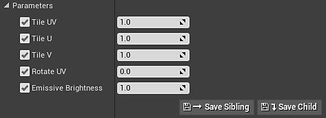

# 材質實例定義 - UE4

你可以用 UE4 的材質實例搭配 Substances。 這樣可以省去 GPU 渲染流程的一大步，避免上傳新的材質來處理。 MID 可以在執行時建立，也可以在編輯器中建立。 在 4.24.0.3版本 中，我們加入了完整的材料實例化支援，並引入了由 Substance 引擎支援的數值輸出材料範本工作流程。 材質範本讓你可以精確定義如何在 UE4 中設定 Substance 材質著色器。

當你匯入 sbsar 檔案時，可以選擇你想使用的範本。

我們附帶了用於處理位移、折射及世界排列材質的模板，這些材質內建調整平鋪、貼圖大小、位移與發射參數的控制。 材質範本系統也允許你提供自訂範本。

## 在編輯器中建立材質實例

1. 右鍵點擊 Substance 建立的 UE4 材質，並選擇「建立材質實例」。 這會產生一個 UE4 的實例材質。

   {width="560px"}
1. 右鍵點擊物質實例工廠，選擇「建立一個圖實例」。 這會建立一個圖的實例，並產生另一個 UE4 材質。 刪除新建立的 UE4 素材，因為這些素材不會被使用。

   {width="300px"}
1. 雙擊你在步驟 1 中建立的材質實例，並啟用所有貼圖的材質參數。
1. 將貼圖設定為第二步建立的新 INST 貼圖。 這會讓材質實例使用實例化圖中的物質輸出映射。

   {width="800px"}

你現在有一個 UE4 材質實例，使用特定的 Substance 材質集合。 這是在 UE4 專案中處理多種物質的更優化方式。 想了解如何使用藍圖建立 MID，請查看此頁面。 [Blueprint（UE4）：動態材質實例](https://helpx.adobe.com/substance-3d/unlisted/documentation/integrations/blueprint-dynamic-material-instance-152535142.html)
