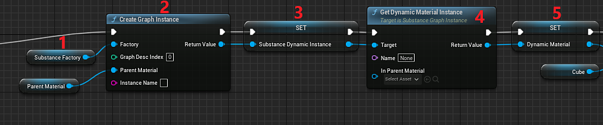

# Blueprint（UE5）：動態材質實例 跳至元資料結尾

1. 建立一個 Substance Instance Factory 型別的變數，並將預設值設為 Imported Substance Factory。
1. 新增一個 Create Graph Instance 節點，並將 Substance Instance Factory 與一個父材質（parent material）一起插入 Factory 輸入，作為範本（這可以是插件預設_substance材質之一）。
1. 建立另一個變數來儲存前一步建立的 Substance Graph Instance 物件。
1. 使用圖形實例中的「取得動態材質實例」功能來建立或取得一個現有的實例。 將 Name 和 In Parent Material 留空，會使用步驟 2 中產生實例時使用的參數。
1. 建立一個 Material 類型的變數。 這就是材質實例動態（MID）。 將「Get Dynamic Material Instance」的回傳值設為變數。

   
1. 新增一個 Set Material 節點，並將 MID 變數的值設為 Material 輸入。 目標設定為你想要套用材質的物件。
1. 可選：設定任意想要的物質參數（此範例使用既有的物質圖實例並將數值複製到新的實例）。
1. 建立一個非同步或同步渲染節點，並將要渲染的實例連接到 Substance Graph 實例變數。
