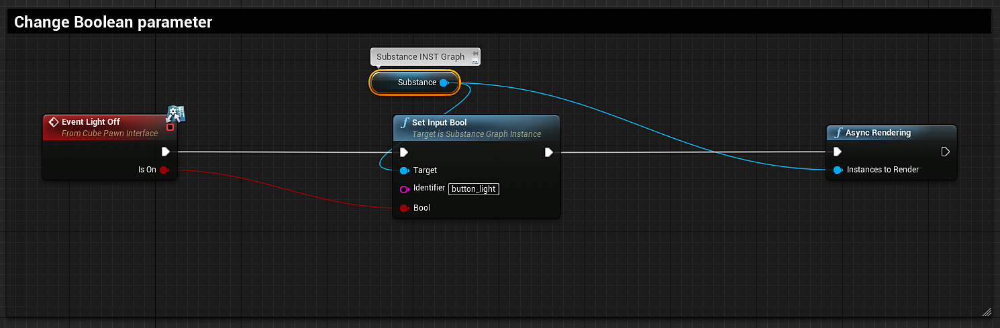

# Blueprint（UE5）：物質材料參數

## 更改浮點參數：

你會使用 [Set Input Float 節點](https://helpx.adobe.com/substance-3d/unlisted/documentation/integrations/blueprint-node-reference-151584784.html) 來更改浮點點數、color（float4） 和布林物質參數。

1. 建立一個變數，並以「Substance Graph Instance」為參考。\
   \**要做到這點，可以在我的藍圖標籤頁加一個變數並命名它。 在下拉選單中搜尋 Substance Graph 實例>物件參考。 將變數拖曳到圖中，選擇取得（變數名稱）。 在細節標籤的預設值區塊中設定 Substance Graph 實例。*
1. 建立一個 Set Input Float 節點，並將目標設定為 Substance Graph Instance 變數。 搜尋視窗中的「情境敏感」框可能需要取消勾選才能查看所有結果。
1. 在設定輸入浮點節點，將識別碼設為要變更的實體參數名稱。\
   *\* 你可以透過打開 Substance INST 並將滑鼠移到參數名稱上來找到識別碼名稱。 識別碼名稱會出現在提示彈出視窗中。*
1. 在輸入浮點節點上，拖出一個連線並建立一個 Make Array 節點。 Make Array 節點的索引為 0。 索引為 0 對應於浮點數值。
1. 建立一個非同步或同步渲染節點，並將 Set Input Float 的執行線連接到渲染節點。 將實例設定為 Substance Graph 實例變數。\
   *\* 非同步是非阻塞，同步是阻塞。*

{width="800px"}

## 布林參數

布林參數可透過 Set Input Bool 進行更改。

{width="800px"}

## 色彩參數

色彩參數可透過設定輸入顏色（Set Input Color）來更改。

{width="800px"}

## 改變整數參數：

整數參數的運作方式與設定輸入浮點數相同。 你會使用 Set Input Integer Node。

## 識別碼

你可以在物質 INST 中找到參數的識別碼。 將滑鼠移到參數上，工具提示會顯示識別碼名稱。 這是 Substance Designer 輸出識別欄位中的名稱設定。

