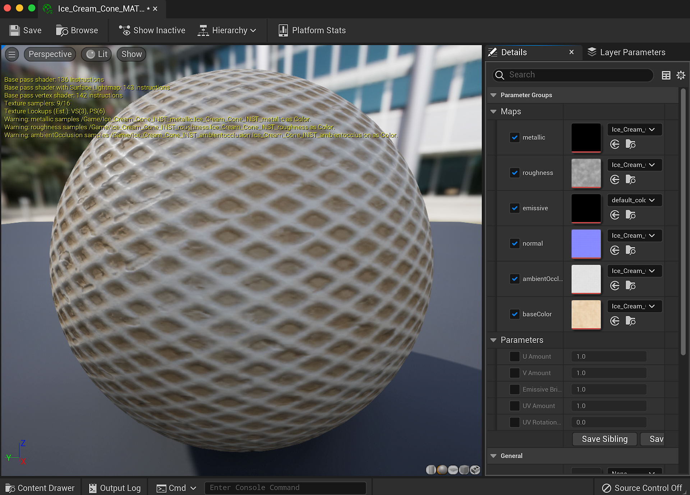

# 材質實例定義 - UE5

你可以用UE5的材質實例搭配物質。 這樣可以省下 GPU 渲染流程的一大步，避免上傳新材質到流程中。 MID 可以在執行時或在編輯器中建立。 在 5.0.0 版本中，我們加入了對材質實例化的完整支援。

## 在編輯器中建立材質實例

1. 右鍵點擊 Substance 建立的 UE5 材質，選擇「建立材質實例」。 這會建立一個 UE5 實例材質。

   
1. 右鍵點擊物質實例工廠，選擇「建立一個圖實例」。 這樣會建立一個圖表的實例，並產生另一個 UE5 材質。 刪除新建立的 UE5 素材，因為這些素材不會被使用。

   
1. 雙擊你在步驟 1 中建立的材質實例，並啟用所有貼圖的材質參數。
1. 將貼圖設定為第二步建立的新 INST 貼圖。 這會讓材質實例使用實例化圖中的物質輸出映射。

   

你現在有一個 UE5 材質實例，使用特定的物質貼圖集合。 這是在 UE5 專案中處理多種物質的更優化方式。 想了解如何使用 Blueprint 建立 MID，請查看此頁面。 [Blueprint（UE5）：動態材質實例](https://helpx.adobe.com/substance-3d/unlisted/documentation/integrations/blueprint-dynamic-material-instance-152535142.html)
