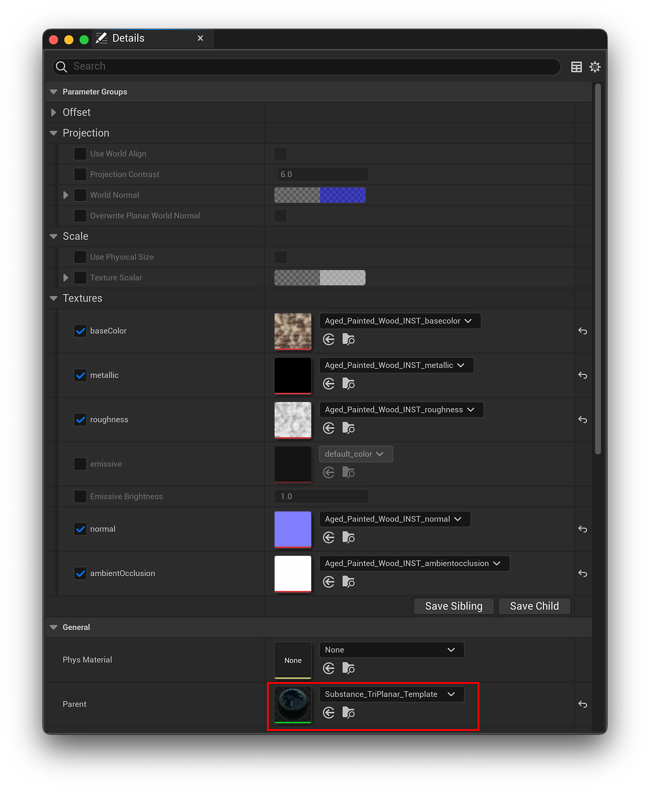
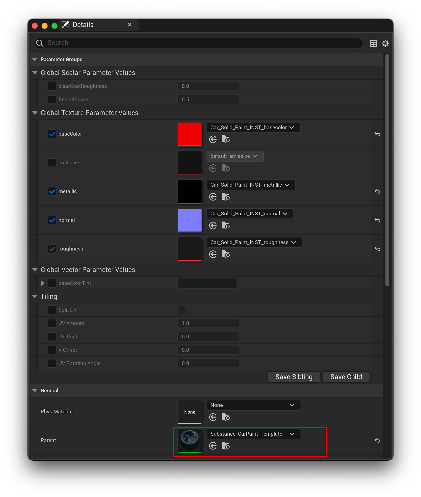
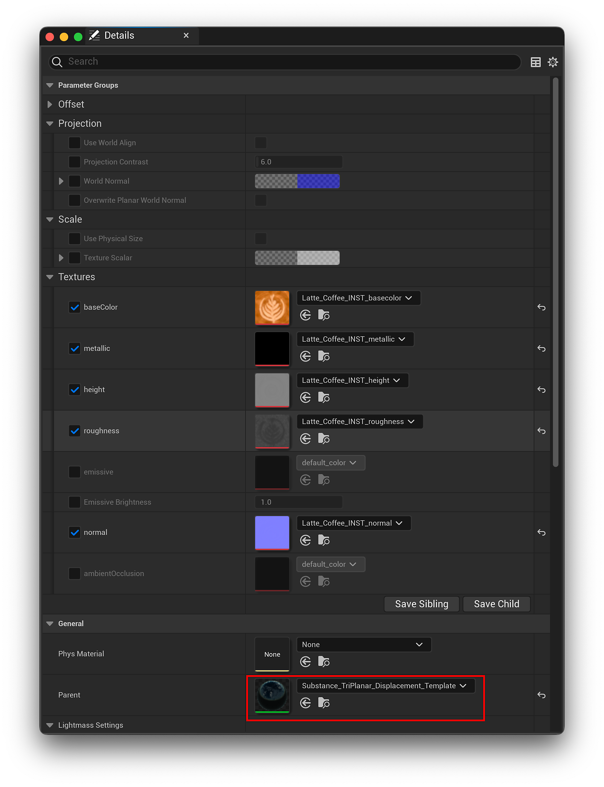

# 開箱即用材質範本

在將 SBSAR 材料匯入內容瀏覽器時，你可以在下拉選單中選擇開箱即用的不同素材範本。

## 物質標準範本

這是一個通用 UV 體驗的基本材質範本。 它提供了基本的 UV 數量控制，讓你可以將 UV 縮放成拉伸貼圖。 你可以啟用分割 UV 選項來分割 UV 縮放，還有 U 量、V 度、UV 偏移和 UV 旋轉角度。 這允許你做一些 UV 平鋪和 UV 旋轉。

## 物質三平面模板

Tirplanar 模板會對網格的 X、Y 和 Z 角度或面做三平面映射，因此會將三種不同的材質投影融合在一起，無縫融合角度。 三平面模板允許材質在物件彎曲時在不同面上融合

三平面模板支援實體尺寸，所以當啟用實體尺寸時，三平面模板會根據材質的物理尺寸來縮放影像，所以無論你怎麼縮放物件，那個貼圖都會保持不變且外觀統一。 了解更多實體尺寸請點此： [實體尺寸 - UE5](../../../../../game-engines/unreal-engine/unreal-engine-5/physical-size-ue5/physical-size-ue5.md)

## 物質折射模板

折射模板主要用於透明物體，例如眼鏡。 它允許你修改 IOR 值或標準材質，這些材質會是玻璃材質或透明材質。

## Substance 汽車塗裝範本

Car Paint 範本新增透明塗層支援，並支援可調整的 UV 磁磚與數值、透明塗層粗糙度值及菲涅爾功率值。

## 設定位移範本

>[!IMPORTANT]
>
> 實驗模板
> 
> 警告：以下範本為實驗性質，版本間可能有重大變動。 這些範本利用了 Epic 的 Nanite 功能，而該功能在撰寫本文時仍屬實驗性質。 它們可能不是百分之百穩定，使用專案時應謹慎。

請依照以下步驟，在您的專案中完全啟用奈米機器人位移支援，並在網格中使用位移材質。

1. 進入專案資料夾>設定> DefaultEngine.ini並打開它
1. 請在 [/Script/Engine.RendererSettings] 區塊中補充以下內容：
   * r.Nanite.AllowTessellation=1
   * r.Nanite.Tessellation=1
1. 選擇你想套用位移模板的靜態網格，然後打開它的設定。
1. 切換啟用奈米機器人支援選項。
1. 將所需的 .sbsar 匯入內容瀏覽器，選擇 Substance\_Displaceent\_Template 或 Susbtance\_Triplanar\_Displacement\_Template
1. 要更改位移量，請進入材質範本並選擇輸出節點。 接著，調整位移部分下的震等。

## 物質置換範本

類似於物質標準範本，此範本允許調整 u 與 V 值，同時加入奈米機器人位移支援。

## 物質三平面位移範本

類似於物質位移範本，此範本套用三平面投影，並可選擇物理尺寸支援並新增奈米機器人位移支援。

