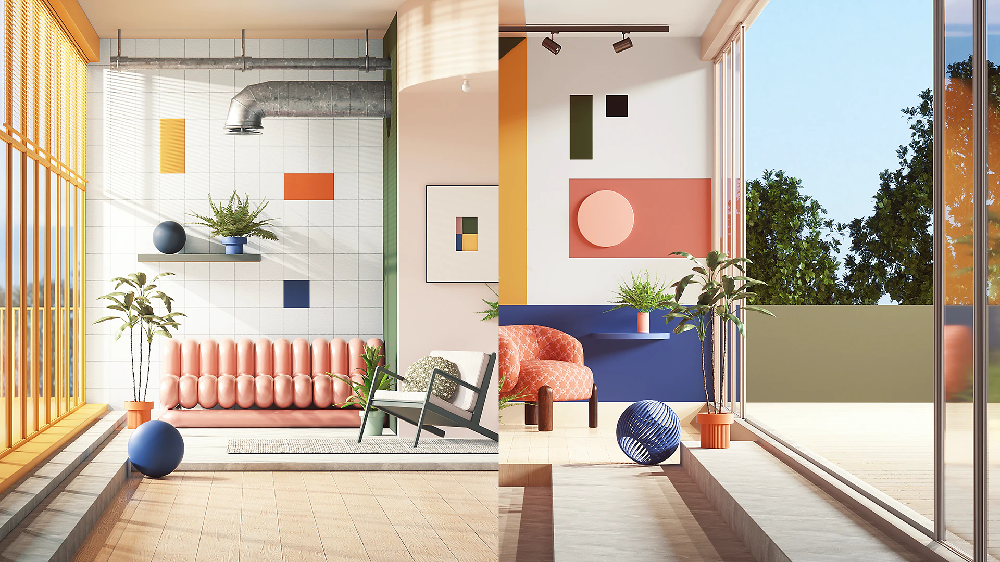

# Adobe Substance 3D 與 Maxon One

Adobe 與 Maxon 合作，將 Substance 3D 與 Maxon One 的優秀 3D 設計與視覺化工具整合於一體。

藝術家：彼得·塔爾卡

談到3D設計與視覺化，Maxon One與Adobe Substance 3D結合提供了多項顯著優勢。 Maxon One 提供一系列創意工具，包括 Cinema 4D、Forger、Red Giant、Redshift、Universe 與 ZBrush，以及日益增長的 Capsules 資產收藏。 Adobe Substance 3D 讓藝術家能使用像是建模器、取樣器、設計師、畫家、舞台設計器等工具，並提供龐大的資產庫存取權。 結合這些業界領先的軟體套件，簡化工作流程、提升生產力，並創造出令人驚豔的視覺效果與沉浸式體驗。

## 一次價值巨大的購買

Maxon One 與 Substance 3D 套裝可在 Maxon 官網[&#128279;](https://www.maxon.net/en/)購買。該套裝包括：

* Maxon One 裡的所有工具。
* Adobe Substance 3D 收藏中的所有工具。
* 使用Maxon與Adobe培訓。

更多資訊可參考 [常見問題](../../partnerships/maxon-and-3d/faq/faq.md) 或 [Maxon的官方網站](https://www.maxon.net/en/)。
