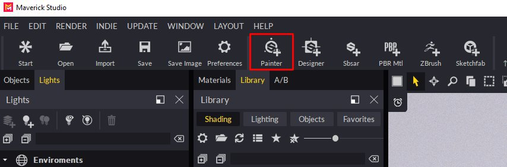

# Substance Painter 整合

>[!NOTE]
>
> **資訊**
> 
> 重要提示：請將我們的預設加入 Substance Painter 安裝程式。\
> 你可以從這裡下載這三個預設：\
> <https://www.dropbox.com/s/11vuk0k0ob772mv/Maverick_Export_Pre>[sets.zip](https://www.dropbox.com/s/11vuk0k0ob772mv/Maverick_Export_Presets.zip)

您可以透過以下步驟輕鬆將您的 Substance Painter 專案帶入 Maverick：

**在《**&#x200B;**實質畫家**》**:**

1. 匯出你的網格。
1. 把你的貼圖匯出到和網格相同的資料夾裡，使用其中一個 Maverick 預設（查看圖片）：

   

   *在一般&#x200B;**情況下選擇**「**Maverick**&#x200B;預設&#x200B;**」。**

   *如果你*&#x200B;已經&#x200B;**&#x200B;繪&#x200B;**&#x200B;**製了特定**&#x200B;地圖&#x200B;**，例如&#x200B;**&#x200B;**&#x200B;各向&#x200B;**&#x200B;異性或&#x200B;**&#x200B;塗層&#x200B;**，請選擇&#x200B;**「**&#x200B;Maverick **Advanced** preset」。***

   *如果你&#x200B;***&#x200B;的模型有相關的&#x200B;**&#x200B;位移&#x200B;**貼圖**，請選擇&#x200B;**「**&#x200B;Maverick **&#x200B; with &#x200B;** Displacement **&#x200B; preset &#x200B;**」。這個*&#x200B;預設&#x200B;**&#x200B;會&#x200B;**&#x200B;以&#x200B;**&#x200B;** 32位元匯出&#x200B;**高度&#x200B;**&#x200B;圖&#x200B;**，讓** Maverick **捕捉所有高品質**&#x200B;幾何&#x200B;**&#x200B;細節**。**

   **在**&#x200B;**《Maverick**》**:**
1. 點擊物質畫家圖示：

   
1. 選擇你從 Substance Painter 匯出的網格檔案。
1. 請依照匯入對話框中的指示操作：

   * 在第一個對話頁面你可以設定一些材質參數。
   * 在第二個對話頁面，你可以選擇模型會出現的氛圍。
   * 在第三個對話框頁面，你可以選擇模型的縮放和軸向。

   
1. 繼續進行後，你的模型會依材質集正確組織，材質也會自動建立與套用。 一切準備就緒，準備進行燈光階段。

   **如果你**&#x200B;**&#x200B;**&#x200B;**在 Substance**&#x200B;**Painter**&#x200B;**修改**&#x200B;**&#x200B;**&#x200B;**材質，請再次&#x200B;**&#x200B;**匯出，**&#x200B;**&#x200B;**&#x200B;覆蓋&#x200B;**&#x200B;**&#x200B;**&#x200B;**&#x200B;**&#x200B;**&#x200B;之前&#x200B;**&#x200B;**&#x200B;的**&#x200B;**&#x200B;材質。**&#x200B; **&#x200B;然後&#x200B;**，在 Maverick &#x200B;**&#x200B;**&#x200B; 裡&#x200B;**，使用更新地圖&#x200B;**&#x200B;**&#x200B;**圖示**&#x200B;**：**

   {width="800px"}

   你可以在以下影片教學中看到完整流程：

   [**https://youtu.be/vw2RPGjPhh8**](https://youtu.be/vw2RPGjPhh8)
