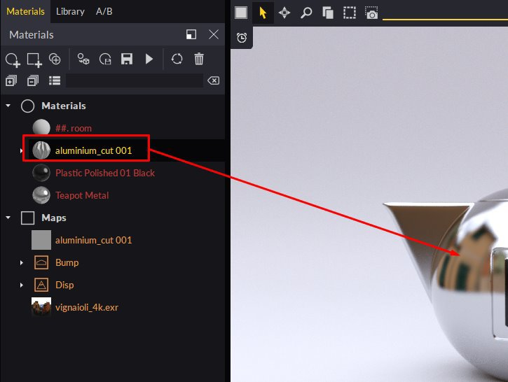

# 物質SBSAR整合

**你可以**&#x200B;輕易&#x200B;****&#x200B;將 Substance Designer 或 Substance **** Alchemist **** 建立&#x200B;****&#x200B;的 SBSAR 檔案&#x200B;****&#x200B;帶&#x200B;****&#x200B;到 ****Maverick ****，使用************&#x200B;以下&#x200B;****&#x200B;兩種&#x200B;****&#x200B;方法**之一**:****

**方法****一：**

1. 請使用 SBSAR 圖示並選擇您的 SBSAR 檔案。

   
1. 在匯入對話框中，你可以設定一些材質參數：

   
1. 繼續操作後，你會看到你的素材出現在材質面板，準備用於你的場景：

   

   **方法****二****:**
1. 只要把 Windows 檔案總管裡的 SBSAR 檔案丟到場景中的任意物件上即可。 你也可以把 SBSAR 檔案放到材質面板上。
1. 在匯入對話框中，你可以設定一些材質參數：

   
1. 材質會套用到你掉落的物件上。

   **技巧與小技巧：**
1. 你可以在材料面板中選擇物質節點，或點擊材料的通道插頭來編輯 SBSAR 參數。
1. 我們建議您以 512 或 1024 解析度進行編輯，以使編輯更流暢。 最終渲染時，你可以把解析度調到 2048 或 4096。
1. 如果你想在場景中的另一個物件上使用相同的 SBSAR，但參數不同，可以複製它並套用到新的物件上。 Maverick 會自動建立一個你可以獨立編輯的新素材。
1. 如果你現場有好幾個 SBSAR，可以用「設定為全域解析度」按鈕同時控制所有 SBSAR。

   
1. Maverick 包含 10 種材料與 SBSAR，您可以在 Shading 圖書館的 Materials/Substance 及 Maps/Sbsar 資料夾中找到：

   
1. 如果你想讓 Maverick 能使用自己的 SBSAR，請建立一個子資料夾將它們放入

   「C：\Users\User\Documents\RandomControl\library\Shading\My Maps」。

   接著，你可以直接把它們放在物件上，讓 Maverick 製作對應的包裝材質。

   你可以在這裡觀看 B-Sar 在 Maverick 的介紹影片： <https://youtu.be/HosZOoMRfcM>

   你可以在這裡看到 Maverick 中使用 SBSAR 的實務範例： <https://youtu.be/ebVI5jJD71A>

   **支援****連結：**

   郵件寄給 [gorilla@maverickrender.com](https://helpx.adobe.com/mailto:gorilla@maverickrender.com)

   Maverick 網站 [的聊天功能 www.maverickrender.com](http://www.maverickrender.com/)
