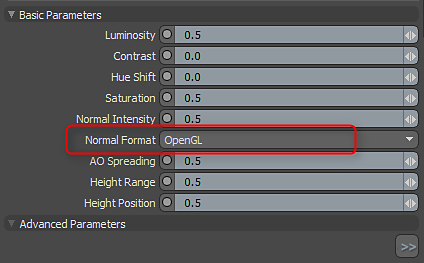

# Octane for MODO

## MODO 插件中的物質

Substance 輸出原生支援 Octane 系統。 你可以使用以下 Substance 輸出和貼圖層效果配置。

1. 建立 Substance>Texture>Create Substance，並將模式設為 Unreal Material。 使用 Unreal 材質可以讓你在 Advanced OGL 視窗中查看貼圖。
1. 建立基色、金屬色、粗糙度和法線的輸出。
1. MODO 使用 OGL 法線貼圖。 在 Substance 屬性中，你需要將法線方向改成 OpenGL。

   
1. 載入 Substance 的 PBR 預設。 這個預設是 Octane Override。 把它拖進你的著色器群組。

   [Substance\_PBR.lxp](https://helpx.adobe.com/content/dam/help/en/substance-3d/documentation/integrations/files/162005234/162005272/1/1502792782697/substance-pbr.lxp)
1. 選擇覆寫，並將 Substance 輸出從剪輯瀏覽器拖曳到 Schematic View。 取檔名為輸出的節點，並將其連接到相應的輸入節點，也就是基底色→基色。

   
1. 接上Substance剩下的輸出

   {width="640px"}
