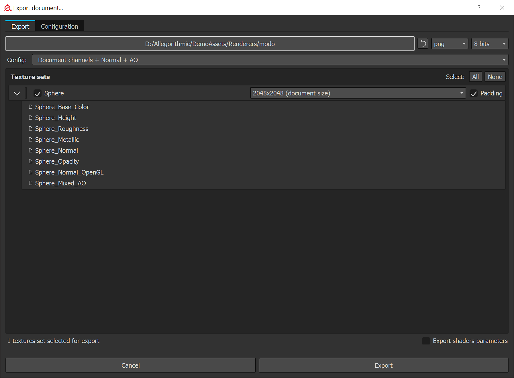

# 工具包

這頁說明如何使用工具包 2 的粗糙度/金屬輸出。

Toolbag 支援鏡面/光澤度與金屬/粗糙度的工作流程。

Substance 3D Painter 預設使用 metallic PBR 著色器，不過你也可以搭配高光/光面著色器使用。 這個工作流程會示範如何使用 Toolbag 2 的金屬輸出。 Toolbag 支援金屬工作流程。

[下載範例場景](https://www.dropbox.com/s/qyed3un2zhtuibj/toolbag.zip?dl=0)

## 從 Painter 出口

1. 使用預設的金屬 PBR 著色器時，我們可以用預設的文件通道 + 法線 + AO 匯出預設來匯出。  ***\*文件通道會根據專案設定匯出法線貼圖。 工具包需要 OGL 法線貼圖。 你可以在專案設定中切換一般格式。***
1. 或者，你也可以建立一個自訂的匯出設定，使用光澤效果

   {width="600px"}
1. 你可以在匯出前把 Normal 格式改成 OpenGL。  **編輯>專案設定**

   

## 材料設置

1. 將反射率設定為金屬度
1. 將反射設定為 GGX
1. 將紋理加入相應的通道，如下圖所示：

   | Substance 3D 畫家貼圖 | 色彩空間 | 工具袋材料 |
   | --- | --- | --- |
   | 基本顏色 | sRGB | 反照率 |
   | 粗糙度 | sRGB 關閉 | 微表面 - 光澤 - 點擊反轉 |
   | 金屬 | sRGB 關閉 | 反射率 - 金屬性地圖 |
   | 正常 | sRGB 關閉 | 正常 |
   | 環境遮擋 | sRGB 關閉 | 遮蔽 |

{width="600px"}
