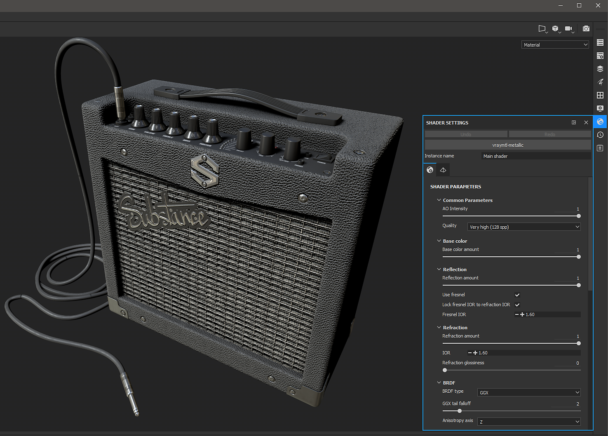

# Vray Next - 物質畫家

Substance Painter 2020.1（6.1.0）內建 [VrayMtl](https://docs.chaosgroup.com/display/VRAY4MAYA/VRayMtl) 著色器，支援金屬與鏡面工作流程。 你可以[用 **VrayMtl 範本**&#x200B;設定 Substance Painter 專案](https://docs.substance3d.com/display/SPDOC/Project+Creation)，這樣就能設定你的視窗著色器。

在著色器設定裡，你可以設定 Vray 著色器來搭配 VrayMtl。

>[!NOTE]
>
> 如果你的專案設定成使用 [UV Tile UDIM Legacy](https://helpx.adobe.com/substance-3d/unlisted/documentation/spdoc/uv-tile-udim-legacy-144310352.html)。 使用 Vray Next UDIM 輸出範本。

{width="800px"}

若要匯出貼圖以在 Vray Next 中渲染，請選擇 Vray Mtl 輸出範本。

{width="800px"}

## Vray 材質（Vray Next - 金屬/粗糙）

| 物質畫家出口 | VRayMtl |
| --- | --- |
| 基色 | （**Maya**）漫反射色彩（數量 = 1.0）（**最大** 3ds）漫反射 |
| 粗糙度 | （**Maya**） 反射 / 粗糙度 （BRDF = GGX） + （啟用粗糙度）（**3ds Max**） 粗糙度 → BRDF/ 使用 GGX 並啟用 使用粗糙度 |
| 金屬 | （**Maya**）反射/金屬感（**3ds Max**）金屬感 |
| 正常 | （**Maya**） 凹凸與法線映射 / 貼圖（Map Type = 切線空間中的法線）（**3ds** **Max**）法線位圖 → 法線 |
| 高度 | （**Maya**） Displacement Shader / displacement （**3ds** **Max**） 物件修改器 → VrayDisplacementMod → Tex Map |
| 發射體 | 自照 |
| 透射式 | （**Maya**） 次表面散射/半透明色（**3ds Max**） 半透明→背面色彩 |
| 各向異性角 | （**Maya**） 各向異性 / 各向異性旋轉（**3ds** **Max**） BRDF / 旋轉 |
| 各向異性水準 | （**Maya**）各向異性 / 各向異性（**3ds Max**）BRDF / 角度 |

## Vray 材質（Vray Next - 鏡面/光澤性

| 物質畫家出口 | VRayMtl |
| --- | --- |
| 擴散 | （**Maya**）漫反射色彩（數量 = 1.0）（**最大** 3ds）漫反射 |
| 反射 | （**Maya**） 反射 / 反射顏色（數量 = 1.0）（**最大** 3ds） 反射 |
| 光澤度 | （**Maya**） 反射 / 粗糙度（BRDF = GGX）+（啟用粗糙度）（**3ds Max**） 光澤度 → BRDF / 使用 GGX 並啟用 使用光澤 |
| 正常 | （**Maya**） 凹凸與法線映射 / 貼圖（Map Type = 切線空間中的法線）（**3ds** **Max**）法線位圖 → 法線 |
| 高度 | （**Maya**） Displacement Shader / displacement （**3ds** **Max**） 物件修改器 → VrayDisplacementMod → Tex Map |
| 發射體 | 自照 |
| 透射式 | （**Maya**） 次表面散射/半透明色（**3ds Max**） 半透明→背面色彩 |
| 各向異性角 | （**Maya**） 各向異性 / 各向異性旋轉（**3ds** **Max**） BRDF / 旋轉 |
| 各向異性水準 | （**Maya**）各向異性 / 各向異性（**3ds Max**）BRDF / 角度 |

>[!NOTE]
>
> 代表資料的地圖必須被正確解讀。 更多資訊請參閱 [色彩管理](../../../renderers/color-management/color-management.md)頁面。

這個範例展示了使用 Vray Metallic/Roughness 著色器的 Substance Painter 視口，以及使用 Maya 的 Vray 渲染。

{width="800px"}
